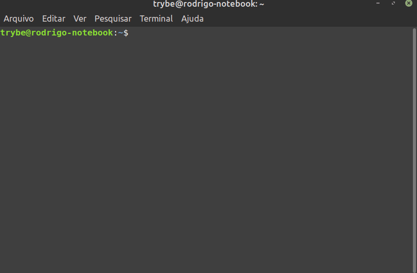

# MySQL na linha de comando
Após seguir os passos anteriores, você poderá agora acessar seu servidor pela linha de comando. Para visualizar quais bancos de dados estão disponíveis, você deve usar o comando:
```
mysql -u root -p
```


## Ver todos os bancos de dados
```
SHOW DATABASES;
```




## Comandos mais comuns

### Formas de referenciar o banco de dados
### USE
Define a referência do banco de dados que será utilizado na query
```sql
USE nome_do_banco_de_dados_que_quero_conectar;
-- EX: USE trybe;
```

### SELECT ... <banco de dados>.<tabela>
```sql
SELECT * FROM banco_de_dados.tabela;
-- EX: SELECT * FROM trybe.students;
```


## Retornar todas as tabelas
```sql
SHOW TABLES;
```


## Visualizar estrutura de uma tabela:
```sql
DESCRIBE node_da_tabela;
-- EX: DESCRIBE students;
```


## Criar banco de dados
```sql
CREATE DATABASE node_do_danco_de_dados;
-- EX: CREATE DATABASE trybe;
```


## Vamos treinar!
1. Entre no banco de dados mysql .
2. Visualize todas as tabelas desse banco.
3. Visualize a estrutura de pelo menos 10 tabelas diferentes e tente entender o tipo de estrutura que costuma ser utilizada.
4. Crie um novo banco de dados com o seu nome e depois entre nele!
5. Pronto!
