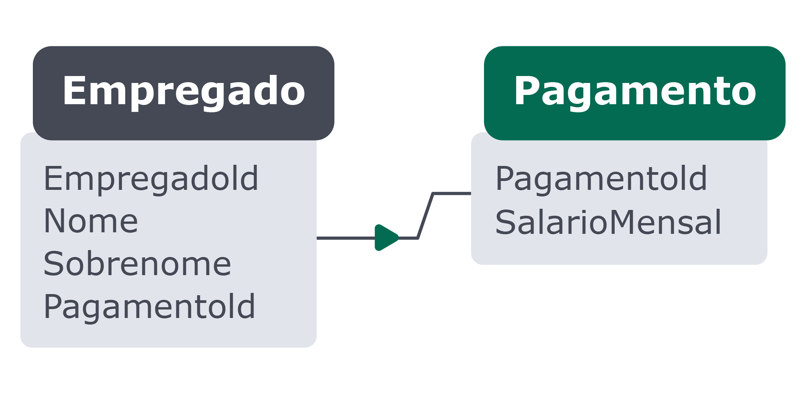
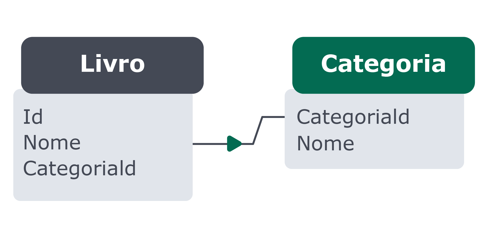
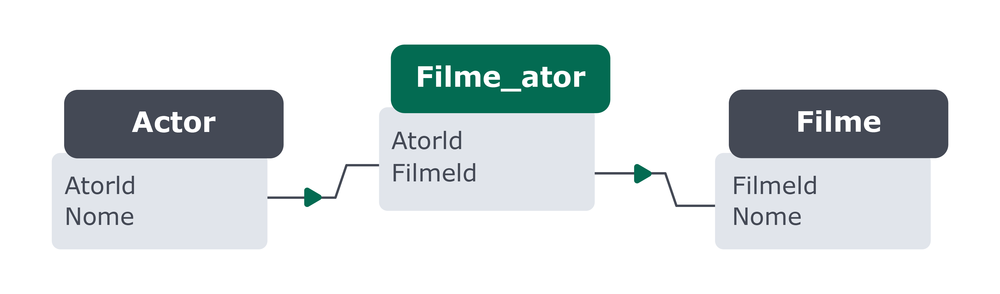

# Como os dados são ligados?

## Um para Um
Uma linha da Tabela **A** só deve possuir uma linha correspondente na tabela **B** ou vice-versa.

Na imagem acima, um empregado só pode estar relacionado a um pagamento, e um pagamento deve estar relacionado a apenas um empregado.

Apesar de ser possível inserir essas informações em apenas uma tabela, esse tipo de relacionamento é usado normalmente quando se quer dividir as informações de uma tabela maior em tabelas menores por questões de performance, a fim de evitar tabelas com dezenas de colunas, ou por várias outras questões específicas de um negócio. Pode ser encontrado em alguns conteúdos com a abreviação: 1:1 (um para um) .

# Um para Muitos ou Muitos para Um
Esse é um dos tipos mais comuns de relacionamento. Em cenários assim, *uma linha na tabela* **A** *pode ter várias linhas correspondentes na tabela* **B** , *mas uma linha da tabela* **B** *só pode possuir uma linha correspondente na tabela* **A** .

Na imagem acima, uma categoria pode estar ligada a vários livros; porém um livro deve possuir apenas uma categoria. Pode ser encontrado em alguns conteúdos com a abreviação: **N:1** (muitos para um) ou **1:N** (um para muitos) dependendo da regra de negócio.

## Muitos para Muitos
O tipo de relacionamento muitos para muitos acontece quando uma linha na tabela **A** pode possuir muitas linhas correspondentes na tabela **B** e vice-versa.

O relacionamento muitos para muitos pode ser visto também como dois relacionamentos um para muitos ligados por uma tabela intermediária, como é o caso da tabela `filme_ator` do banco `sakila` . Podemos chamar essa tabela intermediária de tabela de junção. Ela é usada para guardar informações de como as tabelas se relacionam entre si.

Dessa maneira, quando queremos demostrar que um filme pode contar com vários atores, e também que os atores podem atuar em vários filmes, surge a necessidade de um relacionamento muitos para muitos. Pode ser encontrado em alguns conteúdos com a abreviação: **N:N** (muitos para muitos) .
