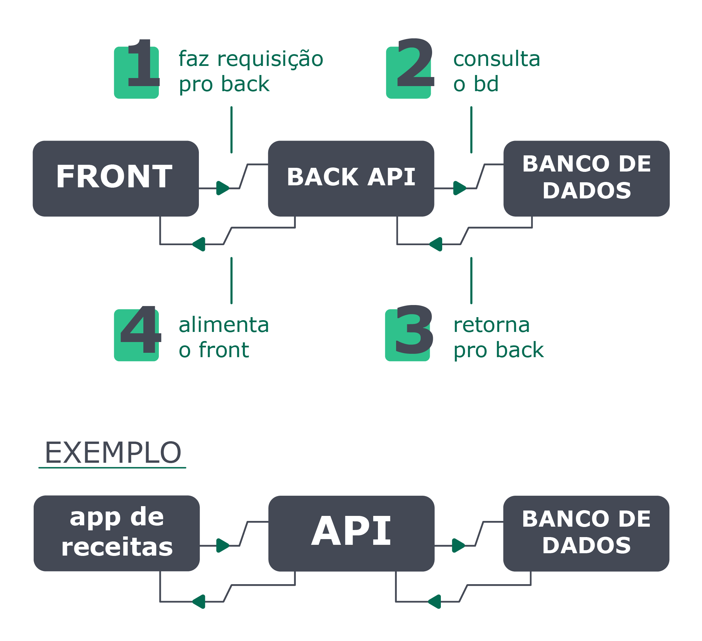

# Importância
Atualmente, a análise de dados é indispensável para as empresas e pessoas em seu processo de tomada de decisão. Essa é uma das maneiras mais eficientes de gerar conhecimento, tanto utilizando dados passados quanto fazendo projeções futuras.

Feita uma análise inicial dos dados, seus resultados serão transformados em informações que, depois de estudadas, podem vir a gerar conhecimentos que, por sua vez, se tornam uma vantagem competitiva para as empresas, além de um norte para as decisões individuais das pessoas.

Uma das formas como nós, profissionais da tecnologia da informação, podemos contribuir para isso é gerando e disponibilizando os dados necessários através de tabelas e consultas criadas dentro de um banco de dados utilizando SQL .

Quando trabalhamos com backend e banco de dados, de maneira geral, o fluxo funciona assim: *O front faz a requisição para o back, o back faz a conexão e consulta o banco de dados. Então o banco retorna alguma informação para o back, e é aqui que a API (Application Programming Interface) trabalha, sendo responsável por processar essas informações, recebendo requisições, enviando respostas e, por sua vez, alimentando o front*.
