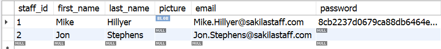

# Contando resultados com o `COUNT`
Em `sakila.staff`:



1. Quantas senhas temos cadastradas nessa tabela?
2. Quantas pessoas temos no total trabalhando para nossa empresa?
3. Quantos emails temos cadastrados nessa tabela?

```sql
SELECT COUNT(password) FROM sakila.staff;
SELECT COUNT(*) FROM sakila.staff;
SELECT COUNT(email) FROM sakila.staff;
```
