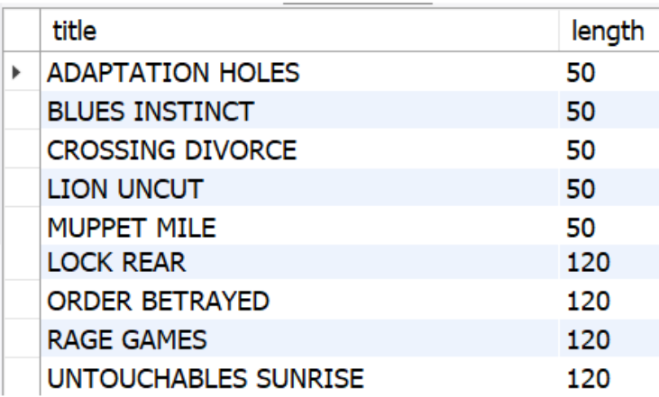

# Englobando uma faixa de resultados com `IN` e `BETWEEN`

## `IN`
Como visto, é possível juntar várias condições nas suas queries usando os operadores AND e OR . No entanto, você ainda terá que digitar cada condição separadamente, como no exemplo a seguir:
```sql
SELECT * FROM sakila.actor WHERE first_name = 'PENELOPE' OR first_name = 'NICK' OR first_name = 'ED' OR first_name 'JENIFER';
```

Uma forma melhor de fazer essa mesma pesquisa seria usando o IN :
```sql
SELECT * FROM sakila.actor WHERE first_name IN ('PENELOPE', 'NICK', 'ED', 'JENIFFER');
```

O mesmo poderia ser feito com:
```sql
SELECT * FROM sakila.customer WHERE customer_id IN (1,2,3,4,5);
```

Para requisições com `IN`, a sintaxe que deve ser usada é a seguinte:
```sql
SELECT * FROM banco_de_dados WHERE coluna IN (valor1, valor2, ..., valorN);

-- ou
SELECT * FROM banco_de_dados WHERE coluna IN (expressao);
```

- Como fazer para encontrar, usando o `IN` , todos os detalhes sobre o aluguel dos clientes com os seguintes ids: 269, 239, 126, 399, 142? As informações podem ser encontradas na tabela `payment` .
- 
- Como encontrar todas as informações sobre os endereços que estão registrados nos distritos de QLD, Nagasaki, California, Attika, Mandalay, Nantou e Texas? As informações podem ser encontradas na tabela `address`.


## `BETWEEN`
Torna possível fazer pesquisas dentro de uma faixa inicial e final.
```sql
expressão BETWEEN valor1 AND valor2;
-- a expressão é a sua query
-- e valor1 e valor2 delimitam o resultado

-- Note que o MySQL inclui o valor inicial e o final nos resultados
SELECT title, length FROM sakila.film
WHERE length BETWEEN 50 AND 120;
```




## `BETWEEN` com strings
Para encontrar uma faixa de valores em que os valores são strings, podemos digitar a palavra por completo para encontrar os valores. Exemplo:
```sql
SELECT * FROM sakila.language WHERE name BETWEEN 'Italian' AND 'Mandarin' ORDER BY name;
```


## `BETWEEN` com datas
Bbasta que digitar o valor no formato padrão da data, `YYYY-MM-DD HH:MM:SS` , sendo os valores de `HH`, `MM` e `SS` opcionais.
```sql
SELECT rental_id, rental_date FROM sakila.rental WHERE rental_date BETWEEN '2005-05-27' AND '2005-07-17';
```


## `IN` x `BETWEEN`
Com o `IN` , precisamos especificar os valores que devem ser incluídos no resultado, já com o `BETWEEN` , não precisamos incluir os valores que estão entre o valor inicial e final.


## Qual tem a melhor performance?
A melhor forma é clicar no botão `Execution Plan` no **MySQL Workbench** e verificar o tempo de execução para tomar a decisão de qual tem o menor custo de execução - o que significa que a query finalizará mais rápido.


## Fixando
1. Mostre o nome, sobrenome e e-mail dos clientes com os seguintes sobrenomes: hicks, crawford, henry, boyd, mason, morales e kennedy , ordenados por nome em ordem alfabética.
2. Mostre o e-mail dos clientes com os address_id 172, 173, 174, 175 e 176 , ordenados em ordem alfabética.
3. Descubra quantos pagamentos foram feitos entre 01/05/2005 e 01/08/2005 . Lembre-se de que, no banco de dados, as datas estão armazenadas no formato ano/mês/dia , diferente do formato brasileiro, que é dia/mês/ano .
4. Mostre o título, ano de lançamento e duração do empréstimo de todos os filmes com a duração de empréstimo de 3 a 6 . Os resultados devem ser classificados em filmes com maior duração de empréstimo primeiro. Em caso de empate, ordene em ordem alfabética pelo título.
5. Monte um relatório que exiba o título e classificação dos 500 primeiros filmes direcionados para as classificações indicativas G, PG e PG-13 . Os resultados devem estar ordenados por título.
```sql
USE sakila;
SELECT first_name, last_name, email FROM costumer
WHERE last_name ('hicks', 'crawford', 'henry', 'boyd', 'mason', 'morales', 'kennedy')
ORBER BY first_name;

SELECT email FROM costumer WHERE address_id BETWEEN 172 AND 176 ORBER BY email;

SELECT COUNT(*) quantidade_de_pagamentos FROM payment
WHERE DATE(payment_date) BETWEEN '2005-02-01' AND '2008-08-01';

SELECT title, release_year, rental_duration FROM film
WHERE rental_duration BETWEEN 3 AND 6 ORDER BY rental_duration DESC, title;

SELECT title, rating FROM film WHERE rating IN('G', 'PG', 'PG-13') ORDER BY title LIMIT 500;
```
