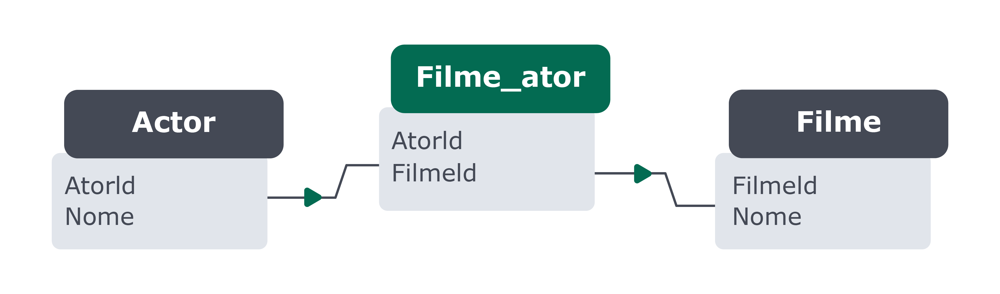

# Database Design - Como modelar um banco de dados
1. Identificar as **entidades**, **atributos** e **relacionamentos** com base na descrição do problema:
   - Por exemplo, a **entidade** *álbum* possui os **atributos** *título e preço* e se **relaciona** com a entidade *artista*.

2. Construir um **diagrama entidade-relacionamento** para representar as entidades encontradas no passo 1:
   - O diagrama serve como um guia para que possamos visualizar as entidades (tabelas) que irão se relacionar.

3. **Criar um banco de dados** para conter as tabela:
   - Após analisar e criar um diagrama de como o banco de dados vai ser estruturado, podemos dar início a criação dele.

4. **Criar e relacionar tabelas** tendo o diagrama do passo 2 como base:
   - Após criar o banco de dados, podemos começar a criar e relacionar as tabelas de acordo com o diagrama.


# Passo-a-passo

## 1. Identificar as **entidades**, **atributos** e **relacionamentos**
Primeiramente devemos identificar as entidades, atributos e relacionamentos com base na descrição do problema, que é criar um catálogo de álbuns musicais. Porém, antes disso é necessário entender o significado de cada um deles.

### Entidades
São uma representação de algo do mundo real dentro do banco de dados e que normalmente englobam toda uma ideia.
Ex:
- Entidade 1: `Álbum`;
- Entidade 2: `Artista`;
- Entidade 3: `Estilo Musical`;
- Entidade 4: `Canção`.

### Atributos
É tudo aquilo que pode ser usado para descrever algo. Por exemplo, uma entidade pessoa pode ter *nome, altura, peso e idade* como atributos.
Ex:
- Álbum: `album_id`, `titulo`, `preco`, `estilo_id` e `artista_id`;
- Artista: `artista_id` e `nome`;
- Estilo Musical: `estilo_id` e `nome`;
- Canção: `cancao_id`, `nome` e `album_id`.

### Relacionamentos
Os relacionamentos servem para representar como uma entidade deve estar ligada com outra(s) no banco de dados. Há três tipos de relacionamentos possíveis em um banco de dados, são eles:
- 1 x 1
  - Nesse tipo de relacionamento, *uma linha* da *Tabela A* deve possuir apenas *uma linha correspondente* na *Tabela B* e vice-versa.

- 1 x N
  - Nesse tipo de relacionamento, *uma linha* da *Tabela A* deve possuir *N linhas correspondentes* na *Tabela B* e vice-versa.

- N x N
  - Nesse tipo de relacionamento, *N linhas* da *Tabela A* deve possuir *N linhas correspondente* na *Tabela B* e vice-versa.

Ex:
- Um artista pode possuir um ou mais álbuns;
- Um estilo musical pode estar contido em um ou mais álbuns;
- Um álbum pode possuir uma ou mais canções.


## 2. Construir um **diagrama entidade-relacionamento**
A ideia de um diagrama ER é prover uma representação gráfica para a estrutura de seu banco de dados, descrevendo suas entidades com seus atributos e como elas se relacionam entre si, usando o modelo *EntidadeA* + *verbo* + *EntidadeB*.

Considerando as entidades Álbum, Artista, Estilo Musical e Canção, foi construído o seguinte diagrama:
| Entidade A        | + verbo + | Entidade B |
|-------------------|-----------|------------|
| (1)Artista        | produz    |  (N)Album  | 
| (1)Estilo Musical | possui    |  (N)Album  |
| (1)Album          | possui    |  (N)Canção |

#### Montando um diagrama mais detalhado
Para diagramas ER (entidade-relacionamento) mais detalhados, deve-se incluir o nome das tabelas, suas chaves primárias e estrangeiras, suas colunas e seus relacionamentos.

> DICA: Por questão de convenções, não são usados acentos ou espaços entre os nomes das tabelas.


#### Relacionamentos presentes entre as tabelas acima:
Tabelas Artista e Album:
- As tabelas Artista e Album possuem um relacionamento de um para muitos (1..N), em que um artista pode possuir um ou mais álbuns.

Tabelas Album e Cancao:
- A tabela Album possui um relacionamento de um para muitos (1..N) com a tabela Cancao, uma vez que um álbum pode conter várias canções.


## 3. **Criar um banco de dados** para conter as tabelas
```sql
-- Cria um banco de dados com o nome especificado.
CREATE DATABASE nome_do_banco_de_dados;

-- Sinônimo de CREATE DATABASE, também cria um banco de dados.
CREATE SCHEMA nome_do_banco_de_dados;

-- Verifica se o banco de dados ainda não existe.
-- Essa verificação é comumente utilizada junto ao CREATE DATABASE/SCHEMA para evitar a tentativa de criar um banco de dados duplicado, o que ocasionaria um erro.
IF NOT EXISTS nome_do_banco_de_dados;

-- Lista todos os bancos de dados existentes.
SHOW DATABASES;

-- Define o banco de dados ativo para uso no momento.
USE nome_do_banco_de_dados;
```

#### Como utilizar um banco de dados
Exemplo com banco de dados sakila.
```sql
SELECT * FROM sakila.actor
-- ou
USE sakila;
SELECT * FROM actor;
```


## 4. **Criar e relacionar tabelas**
### Principais tipo de dados
- Booleans
    - 0 ou 1, onde 0 o valor padrão é nulo.

- Caracteres
    - Tamanho Fixo
      - CHAR(N) - permite e ocupa até N caracteres no banco
    - Tamanho Variável
      - VARCHAR(N) - permite mas não ocupa até N caracteres no banco

- Numeros
    - Exatos inteiros
      - TINYINT = 0 a 255 UNSIGNED ou -128 a 127 SIGNED
        - UNSIGNED - armazena somente valores positivos de 0 a 255
        - SIGNED - armazena valores positivos e nagativs de -128 a 127
      - SMALLINT
      - MEDIUMINT
      - INT
      - BIGINT
    
    - Exatos decimais
      - DECIMAL - permite quantidade maxima de numeros e sua precisao
        - ex: DECIMAL(5,2) = 199.99
      - FLOAT/REAL - tem a precisao de 1 casa decimal
        - ex: 10.9
      - DOUBLE - tem a precisao de 2 casas dedimais
        - ex: 10.99

- Temporais

- primary key e foreign key
   - primary key - uma coluna ou grupo de colunas usada para identificar uma linha em outra tabela
   - foreign key - uma coluna ou grupo de colunas em uma tabela que identifica UNICAMENTE uma linha em outra tabela
   - foreign key - é apenas uma referencia entre as tabelas

- Chave primária composta
    - É uma *constraint* que serve para identificar uma linha e garantir que não haverá dados redundantes em uma tabela.
    - Uma chave primária pode ser formada por uma ou mais colunas de uma tabela, por mais que só possamos ter uma única chave primária por tabela, essa chave pode ser simples (apenas uma coluna) ou composta (conjunto de colunas).
```sql
DROP SCHEMA IF NOT EXISTS Brasil;
CREATE SCHEMA Brasil;
USE Brasil;

CREATE TABLE cidades (
  cidade VARCHAR(100) NOT NULL,
  estado VARCHAR(10) NOT NULL,
  populacao INTEGER,
  CONSTRAINT PRIMARY KEY(cidade)
);

INSERT INTO cidades(cidade, estado, populacao)
VALUES
('Rio Claro', 'RJ', 17216),
('Rio Claro', 'SP', 185421);
```
> Foi criada uma chave primária simples utilizando o campo cidade

> No exemplo acima teremos um erro, pois há uma *violação da chave primária*, já que o nome "Rio Claro" será *duplicado* e isto *não é permitido*.

> A *solução* para o problema acima é criarmos uma *chave primária composta*.


**SOLUÇÃO COM PRIMARY KEY COMPOSTA**
```sql
DROP SCHEMA IF NOT EXISTS Brasil;
CREATE SCHEMA Brasil;
USE Brasil;

CREATE TABLE cidades(
  cidade VARCHAR(100) NOT NULL,
  estado VARCHAR(10) NOT NULL,
  populacao INTEGER,
  CONSTRAINT PRIMARY KEY(cidade, estado)
);

INSERT INTO cidades(cidade, estado, populacao)
VALUES
('Rio Claro', 'RJ', 17216),
('Rio Claro', 'SP', 185421);
```
> No exemplo acima, faz mais sentido criar um campo *id* e utilizá-lo como *chave primária simples*.

**SOLUÇÃO COM PRIMARY KEY SIMPLES**
```sql
-- apagar versao antiga da tabela
DROP TABLE cidades;

CREATE TABLE cidades(
  id INT NOT NULL AUTO_INCREMENT PRIMARY KEY,
  cidade VARCHAR(100) NOT NULL,
  estado VARCHAR(10) NOT NULL,
  populacao INTEGER
);
```

A aplicação de *PRIMARY KEY COMPOSTA* pode ser *vantajosa em* outras situações, como na criação de *tabelas N:N, ou tabelas de junção*. Pois, os campos que contêm as *FOREIGN KEY* de outras tabelas, são utilizados para formar a *PRIMARY KEY COMPOSTA*, garantindo o bloqueio de registros com associações iguais.
Ex:


No caso de tabela *N..N* o recomendado é utilizar os campos `AtorId` e `FilmeId` já existentes para formar uma chave composta, desta maneira conseguimos manter a identificação única e a integridade da tabela sem precisar criar um campo `id` único para usar como chave primária.
```sql
DROP SCHEMA IF NOT EXISTS MeuFlix;
CREATE SCHEMA MeuFlix;
USE MeuFlix;

CREATE TABLE ACTOR(
  ActorId INT NOT NULL AUTO_INCREMENT PRIMARY KEY,
  Name VARCHAR(255) NOT NULL
);

CREATE TABLE Film(
  FilmId INT NOT NULL AUTO_INCREMENT PRIMARY KEY,
  Name VARCHAR(255) NOT NULL
);

CREATE TABLE Film_Actor(
  ActorId INTEGER,
  FilmId INTEGER,
  CONSTRAINT PRIMARY KEY(ActorId, FilmId),
  FOREIGN KEY(ActorId) REFERENCES Actor(ActorId),
  FOREIGN KEY(FilmId) REFERENCES Film(FilmId)
);
```
