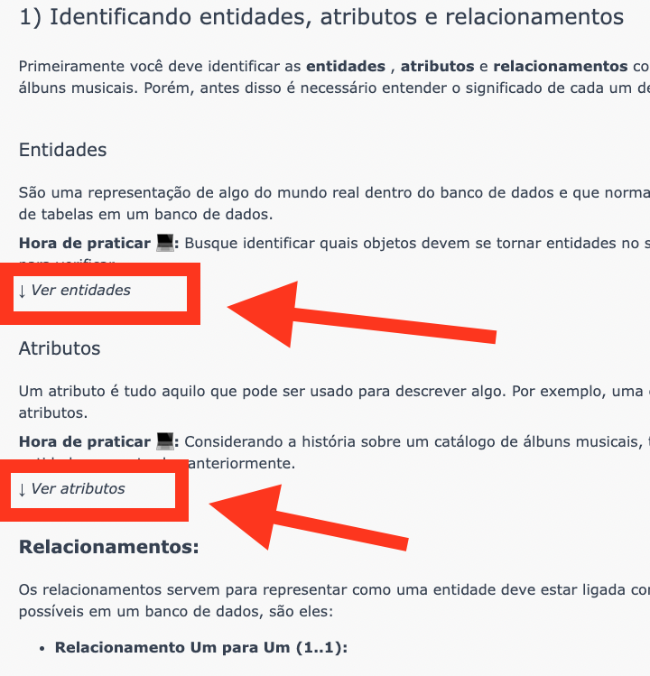

# Exercícios de fixação - normalização de dados
**Exercício 1**: 🚀 Normalize a tabela a seguir para a 1ª Forma Normal.

Não se preocupe em montar a estrutura em código SQL neste primeiro momento. Crie apenas uma planilha (Excel, Google Sheets, Open Office Calc ou semelhantes) da estrutura esperada.
| Funcionario_id |	Nome |	Sobrenome |	Email |	Contato |	DataCadastro |	Setor |
|----------------|-------|------------|-------|---------|--------------|--------|
| 12 |	Joseph   |	Rodrigues |	jo@gmail.com             |(35)998552-1445	| 2020-05-05 08:50:25 |	Administração, Vendas |
| 13 |	André    |	Freeman   |	andre1990@gmail.com      |(47)99522-4996	| 5 de Fevereiro de 2020 |	Operacional |
| 14 |	Cíntia   |	Duval     |	cindy@outlook.com        |(33)99855-4669	| 2020-05-05 10:55:35 |	Estratégico, Vendas |
| 15 |	Fernanda |	Mendes    |	fernandamendes@yahoo.com |(33)99200-1556	| 2020-05-05 11:45:40 |	Marketing |

**Exercício 2**: 🚀 Usando a estrutura (já normalizada para 1ª Forma Normal) da tabela anterior, transforme-a agora na 2ª Forma Normal.

**Exercício 3**: 🚀 Monte uma query que:
- Crie um banco de dados chamado normalization;
- Crie todas as tabelas resultantes do exercício 2 (na 2ª Forma Normal);
- Popule todas as tabelas com os dados fornecidos nos exercícios.




## Bônus:
Transformando ideias em um modelo de banco de dados

Alguns temas ficaram de fora, como `VIEWs` e `INDEX`. Esses e outros temas são melhor abordados no conteúdo [Transformando ideias em um modelo de banco de dados - Parte 2](https://app.betrybe.com/course/real-life-engineer/database-modeling-pt2) que está disponível na área de [Desenvolvimento Web: Vida Real](https://app.betrybe.com/course/real-life-engineer) no course.


# SOLUCAO
- Exercicio 1
### Funcionario
| Funcionario_id |	Nome |	Sobrenome |	Contato |	Telefone |	Data_Cadastro |
|----------------|-------|------------|-------|---------|--------------|
| 12 |	Joseph   |	Rodrigues |	jo@gmail.com             |(35)998552-1445	| 2020-05-05 08:50:25 |
| 13 |	André    |	Freeman   |	andre1990@gmail.com      |(47)99522-4996	| 5 de Fevereiro de 2020 |
| 14 |	Cíntia   |	Duval     |	cindy@outlook.com        |(33)99855-4669	| 2020-05-05 10:55:35 |
| 15 |	Fernanda |	Mendes    |	fernandamendes@yahoo.com |(33)99200-1556	| 2020-05-05 11:45:40 |
### Setor
| Seto_id | Funcionario_id |	Setor |
|---------|----------------|--------|
|    1    |	      12       |  Administração |
|    2    |	      12       |  Vendas |
|    3    |       13       |  Operacional |
|    4    |	      14       |  Estratégico |
|    5    |       14       |	Marketing |
|    6    |       15       |   Vendas  |

- Exercicio 2
### Funcionario
|    id    |  	Nome   |	Sobrenome |	Contato | Telefone |	Data_Cadastro |
|----------|-----------|------------|---------|----------|---------------|
|    12    |	Joseph   |	Rodrigues |	jo@gmail.com             |(35)998552-1445	| 2020-05-05 08:50:25 |
|    13    |	André    |	Freeman   |	andre1990@gmail.com      |(47)99522-4996	| 5 de Fevereiro de 2020 |
|    14    |	Cíntia   |	Duval     |	cindy@outlook.com        |(33)99855-4669	| 2020-05-05 10:55:35 |
|    15    |	Fernanda |	Mendes    |	fernandamendes@yahoo.com |(33)99200-1556	| 2020-05-05 11:45:40 |

### Setor
|    id   |   	Setor     |
|---------|---------------|
|    1    | Administração |
|    2    | Vendas        |
|    3    | Operacional   |
|    4    | Estratégico   |
|    5    |	Marketing     |

### Funcionario_Setor
| Funcionario_id  |  Setor_id  |
|-----------------|------------|
|       12        |     1      |
|       12        |     2      |
|       13        |     3      |
|       14        |     4      |
|       14        |     2      |
|       15        |     5      |

- Exercicio 3
```sql
DROP SCHEMA IF NOT EXISTS normalization;
CREATE SCHEMA normalization;
USE normalization;

CREATE TABLE Setor(
  Setor_id INT AUTO_INCREMENT PRIMARY KEY,
  Setor VARCHAR(100) NOT NULL
) engine=InnoDB;

CREATE TABLE Funcionario(
  Funcionario_id INT AUTO_INCREMENT PRIMARY KEY,
  Nome VARCHAR(50) NOT NULL,
  Sobrenome VARCHAR (50) NOT NULL,
  Contato VARCHAR(100) NOT NULL,
  Telefone VARCHAR(100) NOT NULL,
  Data_Cadastro VARCHAR(50),
) engine=InnoDB;

CREATE TABLE Funcionario_Setor(
  Funcionario_id INT NO NULL,
  Setor_id INT NOT NULL,
  FOREIGN KEY (Funcionario_id) REFERENCES Funcionario(id),
  FOREIGN KEY (Setor_id) REFERENCES Setor(id)
) engine=InnoDB;

INSERT INTO setor(setor_id, nome)
VALUES
  (1, 'Administração'),
  (2, 'Vendas'),
  (3, 'Operacional'),
  (4, 'Estratégico'),
  (5, 'Marketing');

INSERT INTO funcionario
  (funcionario_id, nome, sobrenome, contato, telefone, data_cadastro)
VALUES
  (12, 'Joseph', 'Rodrigues', 'jo@gmail.com', '(35)998552-1445', '2020-05-05 08:50:25'),
  (13, 'André', 'Freeman', 'andre1990@gmail.com', '(47)99522-4996', '2020-02-05 00:00:00'),
  (14, 'Cíntia', 'Duval', 'cindy@outlook.com', '(33)99855-4669', '2020-05-05 10:55:35'),
  (15, 'Fernanda', 'Mendes', 'fernandamendes@yahoo.com', '(33)99200-1556', '2020-05-05 11:45:40');

INSERT INTO funcionario_setor(funcionario_id, setor_id)
VALUES
  (12, 1),
  (12, 2),
  (13, 3),
  (14, 4),
  (14, 2),
  (15, 5);
```

- Entidates
  - setor
  - funcionario
  - funcionario_setor
- Atributos
  - todas as colunas das tabelas
- Relacionamento
  - um setor pore ter 1 ou + funcionarios
  - um funcionario pode trabalhar em 1 ou + setores


