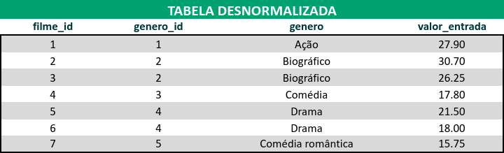

# Normalização
Não é necessário montar queries para resolver os exercícios. Crie novas planilhas com suas respostas.

**Exercício 2**: 🚀 Converta a tabela desnormalizada abaixo para a 1ª Forma Normal. [Planilha aqui](https://assets.app.betrybe.com/back-end/sql/database-modeling/primeira-forma-normal-d014c67b9acc6d0f9e3c884a411ad8d3.xlsx)

 
Tabela desnormalizada  

**Exercício 3**: 🚀 Converta a tabela desnormalizada abaixo (que já está nos padrões da 1ª Forma Normal) para a 2ª Forma Normal.[Planilha aqui](https://assets.app.betrybe.com/back-end/sql/database-modeling/segunda-forma-normal-bfe03f94d64fbf2e114c56819d56ddae.xlsx)

 
Tabela desnormalizada  

**Exercício 4**: 🚀 Agora, converta essa outra tabela (que já está nos moldes das duas primeiras formas) para a 3ª Forma Normal.[Planilha aqui](https://assets.app.betrybe.com/back-end/sql/database-modeling/terceira-forma-normal-b364e3a456f2fc3da2113863ee9455f6.xlsx)

 
Tabela desnormalizada

# Bônus
**Exercício 5**: Faça os exercícios sobre normalização (em inglês) [deste link](https://www.javaguicodexample.com/normalizationnotes.pdf).
