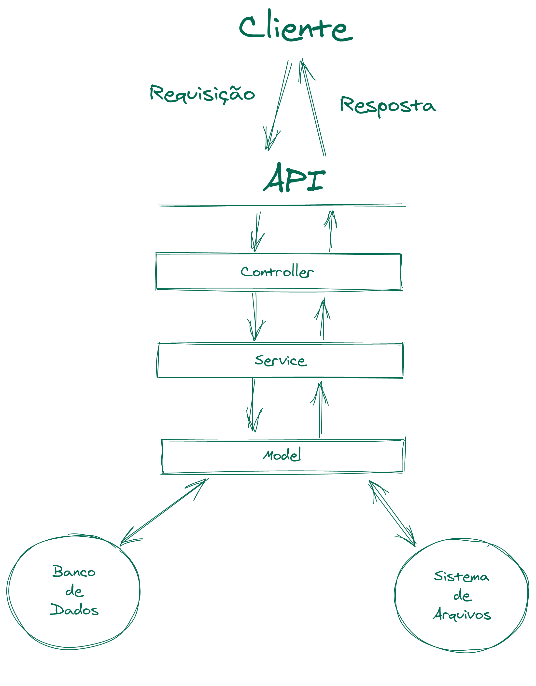

# As camadas de `Controller` e `Service`
Essas duas camadas são, respectivamente, responsáveis por:
- (I) *receber e tratar os dados* da requisição; e 
- (II) *aplicar as regras de negócio* da aplicação antes que qualquer comunicação com o banco seja realizada.

Dessa forma, o `Model` não fica sobrecarregado, visto que teremos uma arquitetura na qual cada camada terá sua responsabilidade bem definida. Por exemplo: Caso seja necessário modificar uma parte do código, a quantidade de lugares que devem ser alterados será menor.

