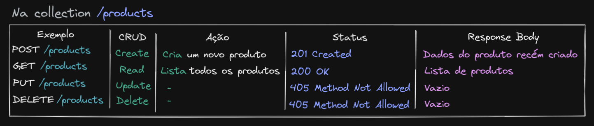
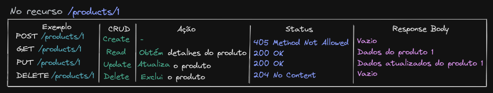
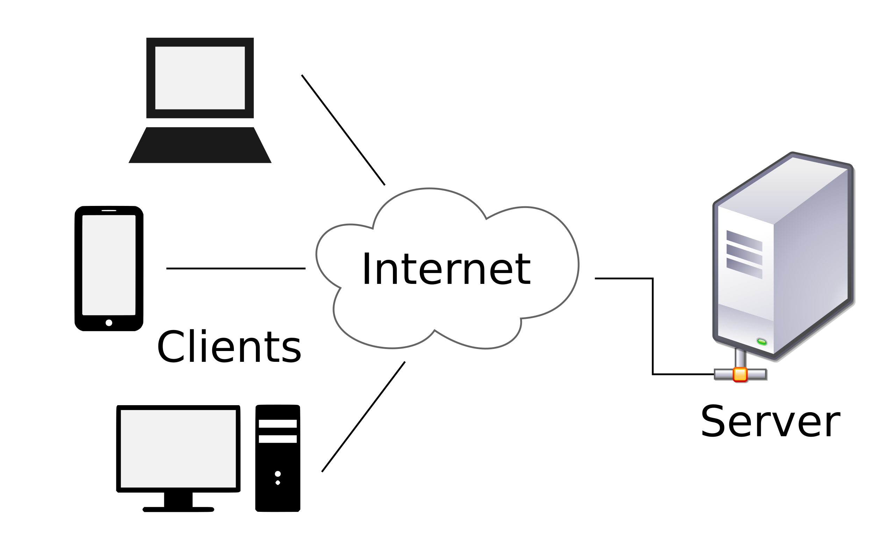

# As 6 restrições para ser RESTful
A arquitetura `REST` **define 6 restrições** (**CONSTRAINTS**), que devem ser respeitadas para que sua API seja `RESTful`.

## 1 - Interface uniforme (Uniform Interface)
A interface de comunicação entre seu servidor e seu cliente deve ser definida e seguida à risca por meio de um padrão, para que assim ela se mantenha consistente. Quando respeitamos essa "*constraint*", ela *simplifica e desacopla* a nossa arquitetura.

Essa interface inclui: **endpoint**, **tipo de retorno** e o uso dos **verbos HTTP**.

### Recursos e coleções
O recurso a ser acessado/alterado deve ser identificado pelo endpoint da requisição.
- Exemplo: https://swapi.dev/api/planets/:id.

Nessa URL o recurso que queremos acessar (planet) é facilmente identificado.

Não importa usar o recurso no singular ou no plural, o importante é manter o padrão da restrição.

### Tipo do retorno
Um `header` chamado `Content-type` nas respostas de requisições serve para dizer, para o cliente, que tipo de conteúdo estamos retornando. Exemplos:
- Se estamos retornando um `JSON`, enviamos o header como `Content-type: application/json`.
- Se nosso retorno fosse `HTML`, seria `Content-type: text/html`.

> ⚠️ Importante: Alguns formatos comuns de `Content-type` são: `JSON`, `XML` e `JavaScript`.

Em síntese, devemos manter nossos retornos consistentes.
- Se o cliente pede ou envia informação no formato `JSON`, devemos processar e retornar mantendo o mesmo formato (`JSON`).
- Se um erro em um endpoint retorna os campos `code`, `error` e `message`, todos os erros devem retornar, pelo menos, nesses mesmos campos.
- Se uma requisição ao endpoint de uma coleção (`GET /posts`, por exemplo), retorna um Array, todos os endpoints de coleção devem retornar Arrays.
- Se, por exemplo, quando realizamos uma requisição `GET /products`, recebemos um array de produtos, ao realizar a requisição `GET /sales`, `NÃO` *devemos receber um JSON no formato* `{ "sales": [{ ... }] }`, já que esse comportamento é inconsistente com o do endpoint `GET /products`.

Dessa forma, ao consumir um endpoint da API, é possível deduzir o comportamento dos demais endpoints, dispensando a ação de "tentativa e erro".

### Ações/Verbos
A ação que vamos realizar no recurso deve ser identificada pelo **verbo HTTP** da requisição. Para o `REST`, os **principais verbos HTTP** são: `POST`, `GET`, `PUT` e `DELETE`. Cada um realiza uma ação específica, que depende do lugar que será enviado, neste caso ou para um endpoint de um recurso ou para um endpoint de uma coleção.
As tabelas abaixo relacionam cada verbo com sua ação e o tipo de endpoint que vai atuar:

Verbos HTTP e ações em coleções REST

Verbos HTTP e ações em recursos REST

### Respostas
*NUNCA* deixe o cliente sem resposta.

Existem boas práticas em relação aos status code que o servidor envia como resposta. Temos uma variedade de códigos que devem ser utilizados em situações específicas:
- 1xx: Informação;
- 2xx: Sucesso;
- 3xx: Redirecionamento;
- 4xx: Erro do cliente;
- 5xx: Erro no servidor.

[lista completa](https://developer.mozilla.org/pt-BR/docs/Web/HTTP/Status)

## 2 - Arquitetura cliente-servidor
Não importa quem é o cliente: *app mobile, web, tv, arduino, entre outros*... As APIs devem conseguir retornar dados para ele. **Isso é o que chamamos de arquitetura cliente-servidor**.

Em síntese, há uma separação de responsabilidades entre o cliente e o servidor.
- O **cliente** se preocupa com a *exibição dos dados, experiência da pessoa usuária, etc*.
- O **servidor** se preocupa com o *armazenamento e acesso dos dados, cache, log e etc*.

## 3 - Sem estado (Stateless)
*É ele que vai tornar possível a API responder a múltiplos clientes.*

Sem estado significa que **toda requisição deve conter todas as informações necessárias (ser autossuficiente) para a API realizar uma ação**. Dessa forma, não podemos reutilizar nenhum contexto que está armazenado no servidor (uma variável, por exemplo).
- Em um app no qual fazemos uma `requisição` para se *logar*, por exemplo, o servidor inicia sua sessão e retorna um `token`. Na próxima requisição, você precisa enviar o `token` novamente, pois o servidor "não se lembra" de você.

Ao criarmos componentes que não tenham estado, temos os seguintes beneficíos:
- Transparência: facilita o trabalho do servidor, pois todas as informações necessárias já estão na requisição;
- Escalabilidade: sem precisar manter estado, nosso servidor pode desalocar recursos que foram alocados para realizar uma ação específica e só voltar a útilizá-los quando necessário.

## 4 - Cacheable
`Cache` é definido como um "depósito de informações".

Esse cache é feito no lado do cliente, no browser. O princípio aqui é que: **as respostas dadas pela API devem dizer, explicitamente, se podem ou não ser cacheadas e por quanto tempo**. Com isso, evita-se que clientes forneçam respostas "velhas" ou inapropriadas.

⚠️ Importante: O cache deve ser usado equilibradamente, se usado demais faz a API perder a confiabilidade; mas, se usado de menos pode sobrecarregar o servidor desnecessariamente.

> Uma camada de cache bem gerenciada pode reduzir ou eliminar iterações do lado do cliente, aumentando a escalabilidade e a performance da nossa API.

No HTTP, o *cache é definido pelo header* `Cache-Control: max-age=120`. Nesse caso, o cliente "cacheia" a resposta da requisição por 120 segundos. Durante esse tempo, o cliente fornecerá a resposta cacheada, sem precisar consultar o servidor.

## 5 - Sistema em camadas (Layered System)
No caso do REST, essa divisão em camadas é sobre: abstrair do cliente as camadas necessárias para responder a uma requisição.

Quem consome a API só precisa receber a **resposta** esperada e não de qual lugar ela vem.

## 6 - Código sob demanda (Code on Demand)
Consiste em dar a possibilidade ao servidor de enviar código (JavaScript, por exemplo) ao cliente, onde será executado. Assim, conseguimos customizar o comportamento do cliente. Exemplo:
- Enviar um "widget" para colocar na página um chat no qual o cliente possa conversar com alguém.

> Observação: Não  é preciso implementar código sob demanda para ser RESTful, logo esse item é considerado opcional.