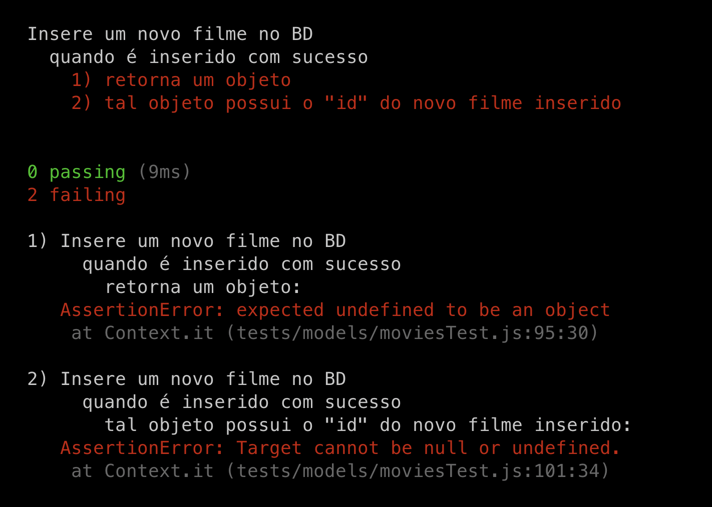
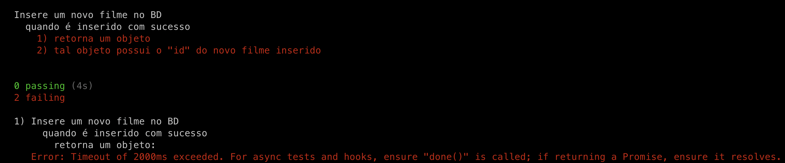

# Testes em model
1. A API deverá permitir a inserção de filmes no banco de dados:
- Ela deve receber e registrar as seguintes informações do filme: `Nome`, `Direção` e `Ano de lançamento`;
- Ao realizar a inserção de um novo filme, o endpoint deverá responder com o respectivo `ID`;

Como estamos falando a princípio de um banco de dados com essas informações, podemos descrever o requisito pensando primeiramente o `Model` com as seguintes asserções/ afirmações:

1. Insere um novo filme no DB
- quando é inserido com sucesso
   - retorna um array
   - o array está vazio
- quando existir filmes criados
   - retorna um array
   - o array não está vazio
   - o array possui itens do tipo objeto
   - tais itens possuem as propriedades: "`id`", "`title`", "`releaseYear`" e "`directedBy`"

Agora vamos reescrever essas mesmas asserções na estrutura de testes:

// tests/models/movieModel.test.js
```js
const { expect } = require('chai');

/*
  Como ainda não temos a implementação, vamos fixar
  um objeto simulando os métodos que iremos desenvolver,
  porém, eles não terão nenhum comportamento
*/
const MoviesModel = {
  create: () => {}
};

describe('Insere um novo filme no BD', () => {
  const payloadMovie = {
    title: 'Example Movie',
    directedBy: 'Jane Dow',
    releaseYear: 1999,
  }

  describe('quando é inserido com sucesso', () => {

    it('retorna um objeto', async () => {
      const response = await MoviesModel.create(payloadMovie);

      expect(response).to.be.a('object')
    });

    it('tal objeto possui o "id" do novo filme inserido', async () => {
      const response = await MoviesModel.create(payloadMovie);

      expect(response).to.have.a.property('id')
    });

  });

})
```

Agora, como só temos esse teste a princípio, vamos executá-lo com `npm test` ou com `NAME=movieModel npm test`.

Testes do model


## Implementação
O segundo passo é de fato implementarmos a camada de `model` *de acordo com os testes* escritos.

1. Criar o arquivo de conexão com o banco de dados, utilizaremos o MySQL:
```js
// models/connection.js
const mysql = require('mysql2/promise');

const connection = mysql.createPool({
  host: 'localhost',
  user: 'root',
  password: 'sua_senha',
  database: 'model_example'
});
module.exports = connection;
```

E então, iniciaremos nosso `model` de movies importando tal conexão e então criando o método para criação de filmes:
```js
models/movieModel.js
const connection = require('./connection');

const create = async ({ title, directedBy, releaseYear }) => {
  const [result] = await connection
    .execute(
      "INSERT INTO model_example.movies (title, directed_by, release_year) VALUES (?, ?, ?)",
      [title, directedBy, releaseYear]
    );

  return {
    id: result.insertId,
  };
};

module.exports = {
  create,
};
```


## Refactor e Test Doubles
Agora, vamos para o último passo do TDD: revisitar os testes escritos para realizar os ajustes necessários de acordo com a nossa implementação!

Vamos começar editando nosso teste para utilizar nossa implementação:
```js
//tests/models/movieModel.test.js

// const { expect } = require('chai');

const MoviesModel = require('../../models/movieModel');

// describe('Insere um novo filme no BD', () => {
//   const payloadMovie = {
//   title: 'Example Movie',
//   directedBy: 'Jane Dow',
//   releaseYear: 1999,
// };

//   describe('quando é inserido com sucesso', () => {

//     it('retorna um objeto', async () => {
//       const response = await MoviesModel.create(payloadMovie);

//       expect(response).to.be.a('object');
//       });

//       it('tal objeto possui o "id" do novo filme inserido', async () => {
//       const response = await MoviesModel.create(payloadMovie);

//       expect(response).to.have.a.property('id');
//     });

//   });
// });
```

Se executarmos nosso teste novamente, teremos o seguinte resultado:

Testes do model pós implementação

Perceba que o nosso teste ainda não está funcionando. Isso aconteceu porque no caso onde o print foi tirado não havia um serviço do MySQL rodando na máquina e a implementação não conseguiu se conectar, causando o erro. Caso você tenha iniciado o MySQL em sua máquina, o teste deverá passar com sucesso, porém, não é o objetivo agora.

Vimos anteriormente que para criarmos testes precisamos isolar o SUT (System Under Test), ou seja, garantirmos que estamos testando somente um trecho de código que tem uma função específica sem adicionarmos comportamentos ou variáveis externas a esse contexto.

Esse conceito requer, por exemplo, que isolemos qualquer operação de IO. **Quando isolamos as chamadas do `fs` ou do `readline` estamos fazendo stub de seus métodos**!

Partimos da premissa que o módulo ou driver que estamos utilizando para fazer a comunicação com o banco de dados já está devidamente testado e funciona conforme esperado.

Dessa forma, nosso objetivo é testar o que está "depois" disso, ou seja, se as regras e comportamentos codificados antes de chegar até o banco de dados ou depois de recuperá-las do BD estão funcionando conforme esperado.

Para isso, ao invés de subirmos um BD (MySQL), faremos um `stub` da conexão. Fazendo-a retornar um `mock` da conexão, ela irá retornar um objeto com as mesmas características da conexão real, porém, serão funções falsas criadas por nós:
```js
// tests/models/movieModel.test.js

const sinon = require('sinon');
// const { expect } = require('chai');

const connection = require('../../models/connection');
// const MoviesModel = require('../../models/movieModel');

// describe('Insere um novo filme no BD', () => {

//   const payloadMovie = {
//      title: 'Example Movie',
//      directedBy: 'Jane Dow',
//      releaseYear: 1999,
//   };

      before(async () => {
        const execute = [{ insertId: 1 }]; // retorno esperado nesse teste

        sinon.stub(connection, 'execute').resolves(execute);
      });

      // Restauraremos a função `execute` original após os testes.
      after(async () => {
        connection.execute.restore();
      });

//    describe('quando é inserido com sucesso', () => {

//      it('retorna um objeto', async () => {
//        const response = await MoviesModel.create(payloadMovie);

//        expect(response).to.be.a('object');
//      });

//      it('tal objeto possui o "id" do novo filme inserido', async () => {
//        const response = await MoviesModel.create(payloadMovie);

//        expect(response).to.have.a.property('id');
//      });

//    });


// });
```
Realizados esses ajustes, teremos nossos testes rodando com sucesso:
