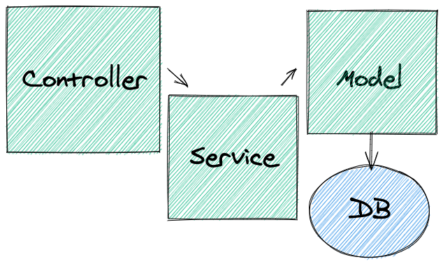

## O que é "Arquitetura de Software"?
Arquitetura é um conhecimento compartilhado por desenvolvedores experientes sobre como organizar um sistema de software - Martin Fowler.

É a maneira como o sistema se organiza, quais são seus componentes, como eles conversam entre si, como as responsabilidades são distribuídas e etc.

Se você tem uma casa na neve, provavelmente o telhado dessa casa terá um formato de "V invertido" bastante inclinado para que a neve não se acumule no topo da residência. Já uma casa em regiões de climas quentes, esse mesmo padrão de telhado não necessariamente precisa ser seguido, visto que ele não acumulará neve. Se uma casa fica em um local com alta taxa de criminalidade, provavelmente, veremos mais muros do que em uma área com menor taxa de criminalidade, e por aí vai.

**Existem padrões de arquitetura específicos para problemas específicos**.

Mas, uma coisa que podemos ver quase sempre, independente da arquitetura utilizada, é a **divisão de responsabilidades por camadas**.

## Regras de negócio
Regras de negócio definem ou restringem algum aspecto de um negócio. São elas que definem como o negócio deve se comportar, quando uma ação deve ser tomada e etc. As regras de negócio devem ser muito bem definidas e documentadas, pois guiam as tomadas de decisões e moldam processos. A princípio, as regras de negócio podem ser executadas manualmente, mas tem se tornado cada vez mais comum automatizá-las com a ajuda de sistemas de software.

Exemplos1:

Imagine um sistema que permite cadastro de pessoas usuárias. Estas são algumas regras de negócio que o sistema poderia ter:
- Uma pessoa usuária deve, necessariamente, informar seu nome, sobrenome e email;
- O email deve ser único, ou seja, não pode haver outra pessoa usuária no sistema com o mesmo email;
- Por conter material sensível, a pessoa deve ser maior de 18 anos e declarar estar de acordo com os termos de uso da plataforma;
- Sempre que uma nova pessoa usuária se cadastrar, uma mensagem de confirmação deve ser enviada para o email cadastrado. Novas pessoas usuárias somente poderão acessar a plataforma após serem verificadas.

Exemplo 2:

Imagine uma rede social fictícia em que as pessoas podem fazer posts sobre os mais diferentes assuntos. Algumas regras de negócio que essa rede social poderia ter são:
- Cada post pode ter no máximo 300 caracteres;
- Pessoas podem comentar nas postagens umas das outras;
- Uma pessoa pode, apenas, editar ou excluir suas próprias publicações;
- Contudo, ela pode bloquear outras pessoas usuárias, impedindo-as de comentar e ver as suas postagens.

Naturalmente, em sistemas de software, as regras de negócio se traduzem em códigos que controlam o comportamento dessas aplicações.

Com o conceito de regras de negócio explicado, podemos falar das **três camadas do MSC** e quais são as responsabilidades de cada uma.

## Arquitetura MSC
Podemos definir as três camadas das seguintes formas:
- *Camada de Modelo (**M**)*: Arquivos onde iremos executar as operações do banco de dados, como criar conexões e executar queries.
- *Camada de Serviço (**S**)*: Arquivos onde iremos estruturar nossas regras de negócio, geralmente é quem chama os métodos definidos na camada de modelo.
- *Camada de Controladores (**C**)*: Interface mais próxima da pessoa usuária ou de uma requisição, irá processar e chamar as devidas funções da camada de serviço.

Obs.: Algumas vezes a camada de Controladores pode se comunicar direto com a camada de Modelo, dispensando o uso da camada de Serviço, principalmente em situações em que não temos uma regra de negócio tão complexa. Mas, cuidado, isso deve ser usado apenas em casos específicos, e uma vez que um endpoint exija o uso de uma camada de Serviço, o ideal é que todos os outros também utilizem essa camada, para que a arquitetura seja respeitada e a aplicação não se torne "bagunçada".
