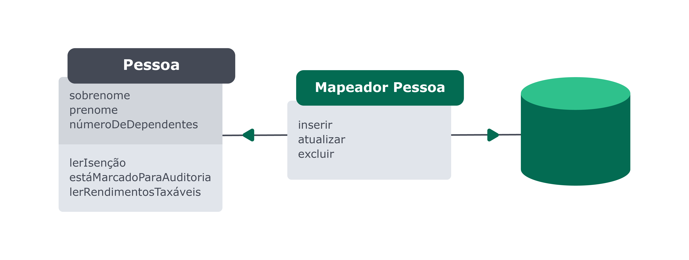
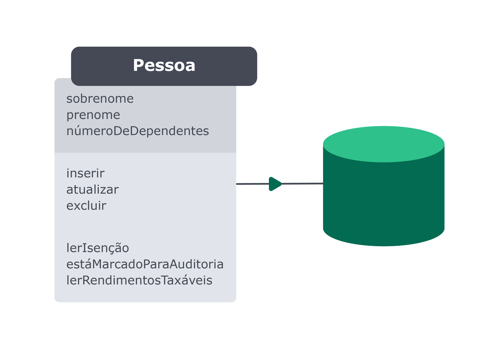

# Mapeamentos
No mercado de trabalho existem dois padrões que são mais utilizados para fazer o mapeamento entre as entidades do banco de dados e os objetos que as representam no código. Esses padrões são o `Data Mapper` e o `Active Record`.

## Data Mapper
No `Data Mapper` a classe que representa a tabela do banco de dados *`NÃO` deve conhecer os recursos necessários para realizar as transações com o banco de dados*.

No `Data Mapper` a *entidade Pessoa está desacoplada do banco de dados*.
- As informações e os comportamentos relacionados à Pessoa no contexto específico do nosso negócio ficam em um lugar.
- Já em outro lugar, o Mapeador Pessoa, temos a camada responsável por criar as transações das informações com o banco de dados.

Isso significa que enquanto o Mapeador Pessoa está fortemente acoplado ao banco de dados e deve ser refatorado ou refeito sempre que houver mudança na estrutura do banco de dados, a entidade Pessoa está completamente independente - a ela não interessa como o banco de dados está. Essa complexidade é absorvida pelo mapeador.

## Active Record
No `Active Record` a classe que representa a tabela *conhece os recursos necessários para realizar as transações no banco de dados*.

No `Active Record` o model está diretamente acoplado ao banco de dados. Dessa forma, o nosso próprio model descreve as operações do banco de dados e tem conhecimento de como salvar os dados, atualizá-los, deletá-los etc.

## Qual padrão usar?
O padrão Active Record é mais simples de se implementar, mas o Data Mapper facilita atualizações e mudanças na estrutura do banco de dados.
