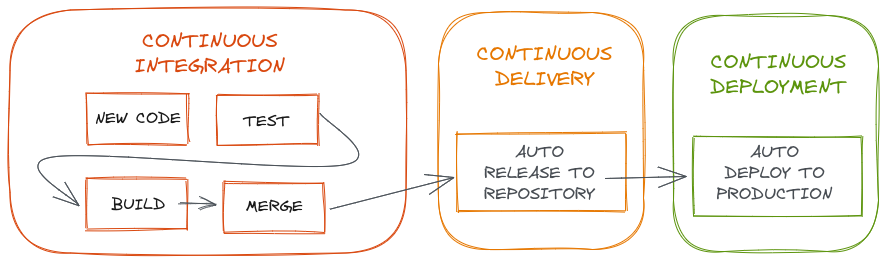

# CI/CD Pipeline

## CI: Continuous Integration
CI é um processo de automação utilizado por pessoas desenvolvedoras. Uma CI é realizada com sucesso quando novas mudanças no código são desenvolvidas, testadas e consolidadas em um repositório, por exemplo: a correção de um bug ou o deploy de uma feature nova. Essa é uma solução ideal para evitar os conflitos quando diversas funcionalidades de uma aplicação são desenvolvidas de forma simultânea por um time.

Se a empresa X precisa mergear vários PRs ou branches em um único dia para realizar o deploy de todas as funcionalidades ao mesmo tempo, provavelmente o trabalho será manual e demorado. Essa estratégia de deploy pode gerar vários conflitos durante a junção de códigos dos desenvolvedores que estão trabalhando separadamente. Esse problema pode ser ainda pior se cada pessoa tiver a sua própria configuração da aplicação, com relação ao versionamento e tecnologias utilizadas.

Ao utilizar a integração contínua (CI), os merges acontecem com mais frequência, as mudanças são consolidadas e testadas de forma automatizada para garantir que as novas mudanças não irão corromper a aplicação final.

Exemplos de ferramentas de integração contínua:
- Actions GitHub: ESLint, testes automatizados, automações, etc.;
- Gitlab CI;
- Jenkins;
- Circle CI.


## GitHub Actions
Segundo o próprio GitHub, com as `Actions` é possível "**criar e compartilhar ações** para realizar qualquer trabalho que desejar, incluindo `CI/CD`, bem como combinar ações em um fluxo de trabalho completamente personalizado."

As `Actions` são ações propriamente ditas que realizam algum tipo de evento, antes ou depois de realizar um push por exemplo, seja ele para a branch principal ou uma branch especifica, tudo irá depender do arquivo de configuração `.yml`.

Exemplo: Action de valiação de ESLint, de StyleLint, de de testes automatizados Evaluator. Caso haja algum conflito, o merge será bloqueado.

Exemplo de arquivo `.yml`:
```
on:   < configura o fluxo de trabalho de quando a action será executada >
  pull_request:
    types: [opened, synchronize]

jobs:   -- < descreve todas as ferramentas que serão executadas pelas actions. >
  eslint:
    runs-on: ubuntu-18.04   -- < atribui a versão a ser executada >
    steps:    -- < passos necessários >
      - uses: actions/checkout@v2
      - uses: actions/setup-node@v1.4.4

  stylelint:
    runs-on: ubuntu-18.04   -- < atribui a versão a ser executada >
    steps:    -- < passos necessários >
      - uses: actions/checkout@v2
      - uses: actions/setup-node@v1.4.4

  evaluator:
    name: Evaluator Job
    runs-on: ubuntu-18.04   -- < atribui a versão a ser executada >
    needs: [eslint, stylelint]    -- < dependências >
    steps:    -- < passos necessários >
      - uses: actions/checkout@v2
      - name: Evaluator step
        id: evaluator
        uses: betrybe/cypress-evaluator-action@v5
```
[mais sobre yml](https://docs.github.com/pt/actions/reference/context-and-expression-syntax-for-github-actions)


# CD: Continuous delivery 
O CD está relacionado com a entrega contínua ou implantação contínua. No geral, representa mudanças feitas por um desenvolvedor que são automaticamente testadas contra bugs e/ou falhas e carregadas a algum repositório, como o GitHub por exemplo. O objetivo final é garantir visibilidade e comunicação entre todas as equipes de desenvolvimento e garantir o mínimo de esforço na implementação de novos códigos em produção.

Exemplo: `deploy automatizado` de uma aplicação.


# Resumo
**CI/CD** geram *monitoramentos* e *automações* contínuas em todo o ciclo de vida da aplicação, incluindo também as etapas de *testes*, *integração*, *entrega* e *implantação*. Essas práticas muitas vezes são chamadas de "**Pipeline de CI/CD**" e são utilizadas juntamente às metodologias ágeis.

