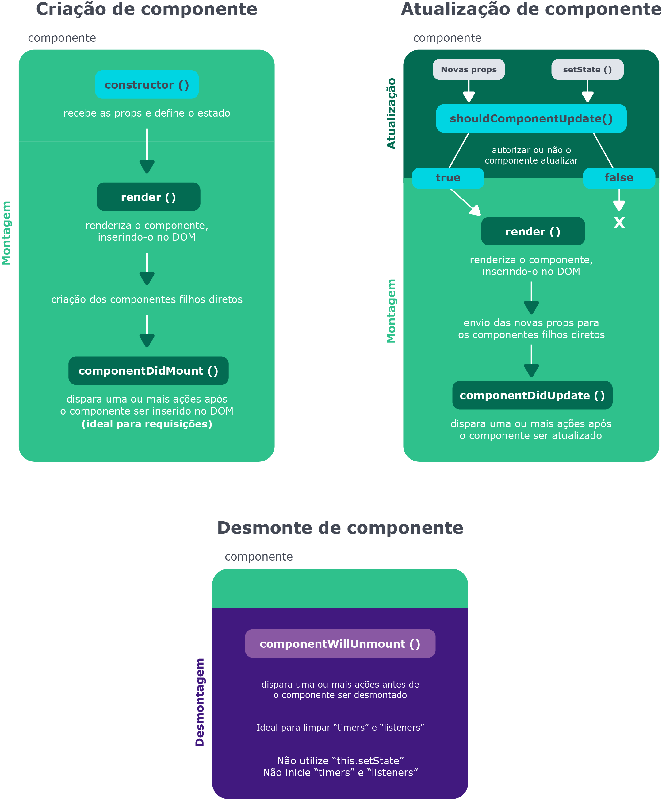

# Ciclo de Vida de um componente React

Existem funções específicas que são executadas ao final de cada fase do ciclo de vida de um componente: `componentDidMount` , `componentDidUpdate` e `componentWillUnmount`. `shouldComponentUpdate` , que pode ser chamada na fase de atualização.

No **React**, o ciclo é dividido em 3 etapas.

1. **Montagem** - quando o componente é inicializado e inserido no DOM;
2. **Atualização** - quando os props ou estados do componente são alterados;
3. **Desmontagem** - quando o componente morre, sumindo do DOM.

[Diagrama em vídeo]


O ciclo de vida é acessível por meio de métodos nativos dos class components. `render` , que é um `método` de **renderização** dos **class components** e que é chamado toda vez que uma atualização acontece. Ele possui características intrínsecas que permitem adicionar o componente no **DOM**.

## O ciclo de vida e os principais métodos funcionam da seguinte maneira:

- Montagem:
- - **`constructor`** - recebe as props e define o estado;
- - **`render`** - renderiza o componente, inserindo-o no DOM;
- - **`componentDidMount`** - dispara uma ou mais ações após o componente ser inserido no DOM (ideal para requisições) ;
- Atualização:
- - **`shouldComponentUpdate`** - possibilita autorizar ou não o componente a atualizar;
- - **`componentDidUpdate`** - dispara uma ou mais ações após o componente ser atualizado;
- Desmontagem:
- - **`componentWillUnmount`** - dispara uma ou mais ações antes de o componente ser desmontado.


## Requisição [API de piadas](https://icanhazdadjoke.com/)

Para isto a função de **fetch** está sendo chamada dentro do método `componentDidMount`.
### Passo 1
```javascript
class DadJoke extends React.Component {
  constructor() {
    super();

    this.saveJoke = this.saveJoke.bind(this);
    this.renderJokeElement = this.renderJokeElement.bind(this);

    this.state = {
      jokeObj: undefined,
      loading: true,
      storedJokes: [],
    }
  }

  async fetchJoke() {
    const requestHeaders = { headers: { Accept: 'application/json' } }
    const requestReturn = await fetch('https://icanhazdadjoke.com/', requestHeaders)
    const requestObject = await requestReturn.json();
    this.setState({
      jokeObj: requestObject,
    })
  }

  componentDidMount() {
    this.fetchJoke();
  }

  saveJoke() {
    //Salvando a piada no array de piadas existentes

  }

  renderJokeElement() {
    return (
      <div>
        <p>{this.state.jokeObj.joke}</p>
        <button type="button" onClick={this.saveJoke}>
          Salvar piada!
        </button>
      </div>
    );
  }

  render() {
    const { storedJokes } = this.state;
    const loadingElement = <span>Loading...</span>;

    return (
      <div>
        <span>
          {storedJokes.map(({ id, joke }) => (<p key={id}>{joke}</p>))}
        </span>

      <span>RENDERIZAÇÃO CONDICIONAL</span>

      </div>
    );
  }
}
```


## Documentação
[Documentação](https://pt-br.reactjs.org/docs/react-component.html#static-getderivedstatefromprops)