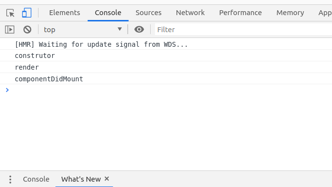
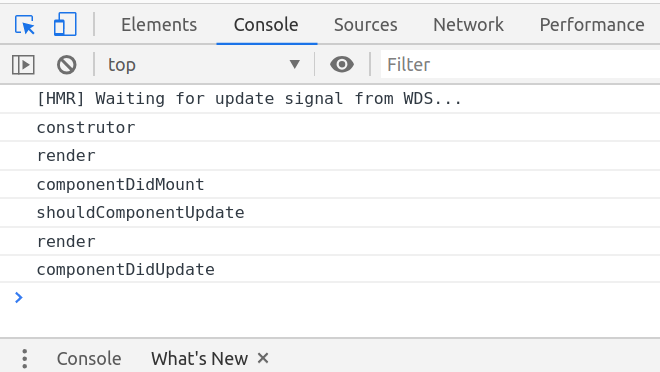
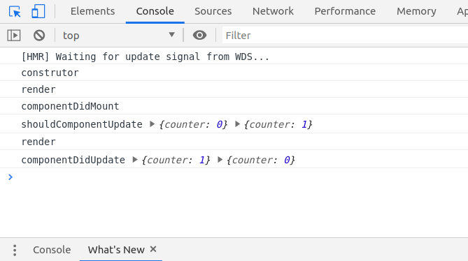

# Entendendo quando cada método é chamado

```javascript
class Counter extends React.Component {
  constructor(props) {
    super(props);
    this.state = {
      counter: 0
    };
    console.log("construtor");
  }

  componentDidMount() {
    console.log("componentDidMount");
  }

  shouldComponentUpdate(nextProps, nextState) {
    console.log("shouldComponentUpdate");
    return true;
  }

  componentDidUpdate(prevProps, prevState) {
    console.log("componentDidUpdate");
  }

  render() {
    console.log("render");
    return (
      <div>
        <p>Contador</p>
        <button
          onClick={() => this.setState((state) => ({ counter: state.counter + 1 }))}
        >
          Soma
        </button>
        <p>{this.state.counter}</p>
      </div>
    );
  }
}
```
Ao executar o código acima, sem o clique no botão `Soma` , aparecerão as seguintes mensagens no console do seu browser :


Imagem que mostra as mensagens 'constructor', 'render' e 'componentDidMount' no console

Atente-se para a ordem de chamada dos métodos. As mensagens refletem a ordem de execução dos métodos de ciclo de vida do componente.

Os métodos `shouldComponentUpdate` e `componentDidUpdate` não apareceram no console, pois não houve atualização. Caso o botão `Soma` seja clicado, teremos mais mensagens no console:

Imagem que mostra as mensagens 'constructor', 'render', 'componentDidMount', 'shouldComponentUpdate' e 'componentDidUpdate' no console

Note que, durante o processo de atualização, o método `render` é chamado novamente. Isso acontece porque, quando se atualiza uma **props** ou **estado**, o React "pede" que o componente seja renderizado no **DOM**. Como apresentado acima, caso seja válido, podemos impedir essa renderização retornando `false` com o método `shouldComponentUpdate` .

Nnos métodos `shouldComponentUpdate` e `componentDidUpdate` podemos também acessar os **estados** ou **props** *próximos* e *anteriores*. Para isso, devemos utilizar os parâmetros **nextProps** e **nextState** no `shouldComponentUpdate` e **prevProps** e **prevState** no `componentDidUpdate`.

```javascript
shouldComponentUpdate(nextProps, nextState) {
  console.log("shouldComponentUpdate", this.state, nextState);
  return true;
}

componentDidUpdate(prevProps, prevState) {
  console.log("componentDidUpdate", this.state, prevState);
}
```

Clicando uma vez no botão Somar , temos:

O estado só é de fato atualizado quando chega no método `componentDidUpdate`. 

Por isso, caso seja necessário impedir uma renderização, você deve utilizar o método `shouldComponentUpdate` , que permite comparar os atuais e próximos estados ou props e adicionar a lógica.


