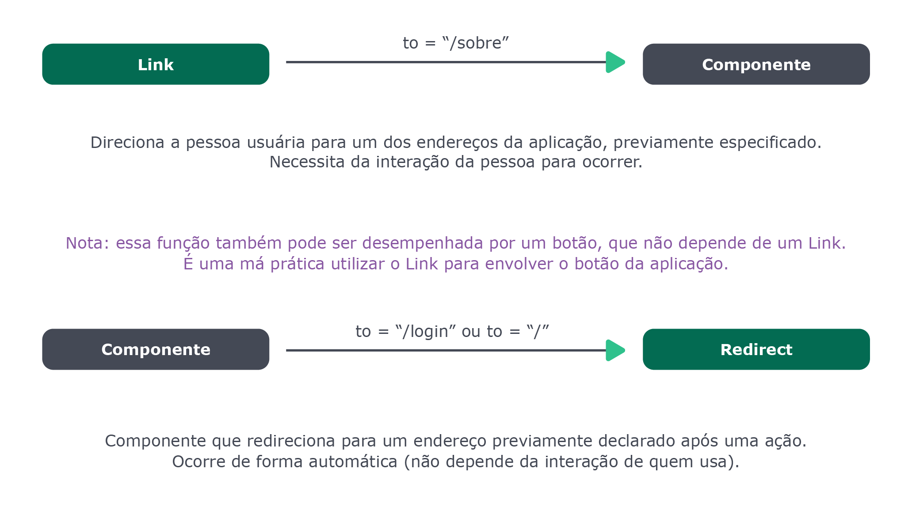

# Componente Redirect

`Redirect` é um componente que permite ativamente levar quem usa a aplicação para diferentes locais dela. Um caso de uso bastante comum de `Redirect` é *autenticação*: a pessoa só pode acessar *informações sensíveis* (tipo conta bancária) de uma aplicação se ela já estiver autenticada; caso contrário, ela é redirecionada para uma página de login. 

Exemplo:
```javascript
<Switch>
  <Route path="/dashboard" component={Dashboard} />
  <Route exact path="/">
    {logado ? <Redirect to="/dashboard" /> : <Login />}
  </Route>
</Switch>
```

Caso a aplicação tenha o caminho `/` será feita uma verificação na variável `logado` , no caso de `true` a página será redirecionada para o caminho `/dashboard` e então renderizará o componente `Dashboard` , caso contrário, renderizará o componente `Login`.

Para redirecionar dê sempre **prioridade** para `Redirect`.
