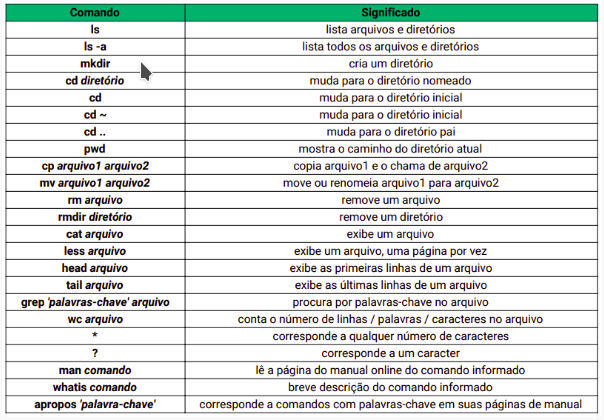

# LINUX

## UNIX montado em 3 niveis
- <b>KERNEL</b> - responsavel por fazer a interação entre software e hardware
- <b>SHELL</b> - interface de linha de comando entre o SO, usuário e núcleo do SO (kernel) 
- - a função do shell é ler, interpretar, executar a linha de comando e retornar o resultado.
- <b>APLICATIVOS</b> - softwares e comandos do UNIX

O unix interpreta cada tarefa ou comando como um processo. Cada processo possui um identificador único chamado PID (Process IDentifier), que reúne informações como o usuário proprietário, sessão do shell e estado atual.

No unix tudo é arquivo e cada arquivo possui tipo, permissões, hard links, dono, grupo, tamanho, data e hora da última modificação e nome.
Ex: 
```
-rw-r--r-- 1 jose aluno 3820 Apr 6 16:22 Leia-me.txt
```

## HIERARQUIA DE ARQUIVOS UNIX
- <b>/BOOT</b> - contém os arquivos necessário para a inicialização/ boot do sistema.
- <b>/BIN</b> - pasta que contém os arquivos binários executáveis do sistema. Além disso, há também utilitários para configuração do sistema e gerenciamento de arquivos.
- <b>/SBIN</b> - binários de sistemas importantes. Contém arquivos executáveis necessários para o boot, para recuperação e reparos. Somente podem ser executados pelo usuário root.
- <b>/DEV</b> - são aramazenados os ficheiros especiais ligados aos dispositivos do sistema, ex: hd.
- <b>/ETC</b> - contém os scripts de inicialização. Em etc ficam os arquivos de configuração e aplicativos do sistema.
- <b>/HOME</b> - só existe 1 deretório home no sistema, cada usuário, incluindo o root, possui uma subpasta dentro do diretório _/home_.
- <b>/PROC</b> - mantém informações sobre o estado do sistema, incluindo os atualmente executados. _PROC_ contém arquivos especiais do Kernel e de processos que interagem com ele. Não armazena arquivos, mas sim informações sobre o hardware e sobre a configuração do sistema.
- <b>/ROOT</b> - diretório home do usuário root
- <b>/TMP</b> - arquivos temporários
- <b>/USR</b> - no unix existe apenas um diretório _/usr_, nele são armazenados aplicativos e arquivos que são na maioria das vezes disponíveis para acesso de todos, armazena os executáveis e bibliotecas da maioria dos programas instalados no sistema. A maior parte dos aplicativos e outros componentes ficam instalados dentro dessa pasta.
- <b>/VAR</b> - arquivos variados, como logs e banco de dado. Contém arquivos que são modificados com o decorrer do uso do sistema.


## COMANDOS 

sudo apt install (nome do programa) git -y – instala algum programa
sudo apt unistall (nome do programa) git -y – desinstala algum programa

pwd – mostra localização no sistema
echo~ - mostra localização no sistema

man - manual de comandos do linux

mkdir – cria ou move diretório
rmdir - apaga diretório vazio
rm -rf – apaga diretório não vazio
rm -v – explica o que está sendo feito
rm -f – ignora arquivos existentes
rm -r – apaga diretório não vazio
rm – apaga arquivo
mv – move ou renomeia um arquivo
cp - copia um arquivo (pode copiar e alterar o nome do arquivo no diretorio ao mesmo tempo)

ls – lista o que há na pasta
ls -l – lista todos os arquivos 
ls -a - lista todos os arquivos inclusive os ocultos
tmp – mostra os arquivos temporários

df -h – mostra os dispositivos que estão montados, sua capacidade e espaço livre

touch – toca ou cria um arquivo
nano - editor de textos
vi - editor de textos (mais poderoso que o nano)

echo – serve para escrever no (STDOUT) Standard OutPut normalmente dentro do próprio shell
```
echo “dede” (vai escrever dede no shell)
echo “dede” > a.txt (vai escrever dede dentro do arquivo a.txt)
só um > sobrescreve outro escrito antes dentro do arquivo, porém >> adiciona uma linha nova ao arquivo
Obs.: posso escrever algo e já criar um arquivo ao mesmo tempo? 
Sim. 
Como? Comando → echo “texto q quero” > nome e extensão do arquivo
ex.: echo “dede” > b.txt 
```

cat – olha conteúdo do arquivo
```
cat a.txt (vai ver o que tem dentro do arquivo a.txt)
...ou seja, vai achar dede escrito no arquivo a.txt
ps aux | cat		(mostrará tudo de uma vez)
cat <nome do arquivo> (mostrará tudo de uma vez)
cat, indicado para arquivos pequenos
```

less – mostra o que tem dentro de um processo ou arquivo em uma página. Barra de espaço vai avançando as páginas.
less pode ser precedido de “|” (pipe) ou não
ex: 
```ps aux | less	(mostrará os processos do sistema uma página do shell por vez)
less <nome do arquivo> (mostrará uma página por vez)
less, indicado para arquivos grandes
```

head - mostrar as 10 primeiras linhas do arquivo 
head <nome do arquivo>
head -5 <nome do arquivo> (visualizar as 5 primeiras linhas do arquivo)

tail – mostrar as 10 últimas linhas do arquivo 
tail <nome do arquivo> (mostra as últimas 10 linhas)
tail -5 <nome do arquivo> (mostra as últimas 5 linhas)
tail -f – permite ler atualização do arquivo enquanto digitada em outro terminal

Como fazer buscas dentro de um arquivo ?
less <nome do arquivo> 
/<palavra a ser buscada>
n vai passear entre as palavras achadas

grep <palavra a ser buscada> <nome do arquivo> (forma padrão - case sensitive)
grep -i <palavra a ser buscada> <nome do arquivo> (<b>i</b> ignora o case sensitive)
grep -iv <palavra a ser buscada> <nome do arquivo> (ignora o case sensitive e o valor buscado - ou seja, vai listar todos os arquivos, exceto o buscado)
grep -in <palavra a ser buscada> <nome do arquivo> (ignora o case sensitive e mostra tb a linha da palavra busca)
grep -ic <palavra a ser buscada> <nome do arquivo> (ignora o case sensitive e mostra a quantidade de vezes que a palavra foi achada)

wc - mostra quantidade de linhas, palavras e caracteres do arquivo
wc -w - mostra a quantidade de palavras do arquivo
wc -l - mostra a quantidade de linhas do arquivo
wc -c - mostra a quantidade de caracteres do arquivo

ls * - mostra tudo dentro do diretório e subdiretórios, sem precisar entrar nos subdiretórios
ls ? - ? usado quando não lembramos alguma letra da busca

