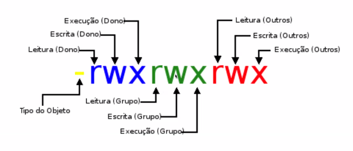
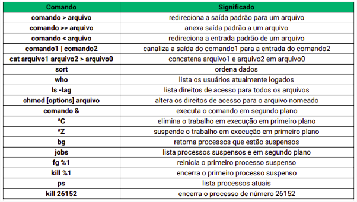

# LINUX - PARTE 2
## INPUTS E OUTPUTS 
Se dermos o comando `cat` no terminal sem nenhuma chamada, o terminal vai ficar esperando um input(entrada) na linha debaixo. Que quando dado `enter` nesse input ele será exibido logo abaixo.

- <b>cat</b>
```
cat > <nome do arquivo>
(input) escrever o que quiser no arquivo 
CTRL + D para salvar e sair

cat >> <nome do arquivo>
(input) para continuar escrevendo no arquivo 
CTRL + D para salvar e sair

cat para juntar arquivos em um novo arquivo
cat <arquivo 1> <arquivo 2> > <novo arquivo>
```

- <b>sort</b> - organiza visualização de `outputs` em ordem alfabética
- <b> sort <</b> - altera a organização dos valores dentro de sort mas não dentro do arquivo 
```
sort < <nome do arquivo>
vai ordenar todos os valores dentro do arquivo para visualização, sem alterá-lo de fato.

sort < <arquivo 1> > <arquivo 2>
vai ordenar o arquivo 1 e essa ordenação será enviada para o arquivo 2, o arquivo 2 não precisa existir, pode ser criado nesse mesmo comando como está.
Ou seja, vai pegar o arquivo 1 bagunçado, vai organizar, criar o arquivo 2 e salvar nele, nessa ordem.
```

# DIFERENÇA ENTRE > >> e |
- <b>></b> - direciona a entrada para um arquivo, caso haja algum conteúdo no arquivo ele será substituído.
```
cat > nomes.txt
<texto>
CTRL + D
```

- <b>>></b> - anexa o input ao final do arquivo
```
cat >> nomes.txt
<texto>
CTRL + D
```

- <b>|</b> - canaliza a saída do primeiro comando para a entrada do segundo. dessa forma é possível realizar comando sucessivos.
```
Lista de nomes com a letra F e em ordem alfabética
grep F nomes.txt | sort
// resultado
Falcão
Flávio
```

## QUEM ESTÁ UTILIZANDO E PERMISSÕES
- <b>who</b>
MOstra quem está utilizando o sistema e tem acesso as informações.


|Permissões | Links| Proprietário | Grupo | Tamanho | Data e Hora   | Nome|
|-----------|------|--------------|-------|---------|---------------|------|
|drwxr-xr-x | 2    | root       | root  | 4096    | Out 19 09:10  |composer/|

- Permissões - É possível verificar o tipo do item e nível de permissão para Leitura, Escrita e Execução de item ou diretório;
- Links - Número de ligações que o item possui, no caso do diretório, número de subdiretórios que possui;
- Proprietário - Quem é a pessoa dona, quem criou. É o diretório padrão da pessoa usuária, o home;
- Grupo - Grupo ao qual pertence o item ou diretório. Utilizado para dar permissões à outras pessoas;
- Tamanho - Em Bytes;
- Data e Hora - Momento em que foi criado ou última modificação;
- Nome - Nome do item ou diretório;



- <b>chmod</b> - alterar permissão de usuário, grupo de usuário e outros usuários
```
chmod a/o/g+<tipo de permissao> (+ add permissão)
chmod a/o/g-<tipo de permissao> (- rm permissão)
chmod a/o/g= (mantém igual)
chmod a/o/g+<tipo de permissao> *

a = todos   (all)
u = dono    (owner)
g = grupo   (group)
o = outros usuários (others users)
```

### Valor dos caracteres
- r = 4
- w = 2
- x = 1

ou 

rwx = 111 ( 7 | Acesso Total )
r-- = 100 ( 4 | Somente Leitura )
-w- = 010 ( 2 | Somente Escrita )
--x = 001 ( 1 | Somente Execução )
rw- = 110 ( 6 | Somente Leitura e Escrita )
r-x = 101 ( 5 | Somente Leitura e Execução )
-wx = 011 ( 3 | Somente Escrita e Execução )
--- = 000 ( 0 | Todos Acessos Negados )
```
chmod 766 <arquivo ou diretório>
```

# PROCESSOS
- <b>ps</b> - mostra lista de processos executados no exato momento. Com o ps os processo virão identificados com seus PIDs

.- <b>sleep</b> - é um processo que para o terminal por determinado tempo ee o terminal ficará travado enquanto ele roda
```
sleep 5
vai rodar por 5 segundos 
```

- <b>jobs</b> - mostra todos os processos que estão sendo executados, suspensos ou em background.jobs 

### Criar processos e deixá-los em backgroundjobs

sleep 10 `&`
o `&` vai deixar o processo sleep em background de modo a liberar o terminal para uso

- <b>^Z</b> (CTRL + Z) - suspende um processo
- <b>bg</b> - joga o processo para background, mesmo se suspenso e continua o processo
- <b>fg %</b> - pega um processo em bg e joga pra frente do terminal
```
fg %<numero da linha do processo>
% é o número da linha do processo
```

- <b>^C</b> (CTRL + C) - cancela um processo
- <b>kill %</b> - cancela um processo em bg
```
kill %<numero da linha do processo>
```

Também é possível cancelar um processo pelo seu PID
```
kill <numero do PID do processo>
```

- <b>kill -9</b> - mata processo na força
```
kill -9 <PID do processo>
```

# FIND, HISTORY, ECHO

- <b>find</b> - comando para pesquisar em diretórios por arquivos ou outros diretórios, de acordo com os parametros passados. Esses parametros podem ser `name`, `date`, `size` e `type`. Caso nenhum atributo seja passado, ele pesquisarátudo que estiver dentro do diretório atual.
Ex:
Llistar todos os arquivos que terminem em `.txt`
```
find . -name "*.txt"
```

Localizar todos os diretórios
```
find . -type d
```

Localizar todos os arquivos
```
find . -type f
```

Localizar tanto arquivos quanto diretórios que comecem por algum trecho.
```
find ./teste -name exemplo*
# ./teste/exemplo.txt
# ./teste/exemplo
```

Localizar someente arquivos que comecem por algum trecho 
```
find ./teste -type f -name "exemplo*"
# ./teste/exemplo.txt
```

Localizar somente diretórios que comecem pro algum trecho 
```
find ./teste -type d -name "exemplo*"
# ./teste/exemplo
```

- <b>history</b> - lista o histórico de comandos executados
```
history     (histórico de comandos)
history | tail      (histórico dos últimos 10 comandos)
```

- <b>echo</b> - comando utilizado em scripts ou no terminal para exibir mensagens na tela ou em um arquivo
```
echo "Testanto echo"
# Testando echo

echo Meu Vascao > teste.txt
cat teste.txt
# Meu Vascao
```

 

# RECAPITULANDO
- Unix é um sistema operacional que inspirou muitps outros sistemas, como MacOS, Linux, Solaratis etc.
- O Unix é composto basicamente pelo `Shell`, `Kernel` e os `programas`.
- A estrutura de diretórios do Unix é organizada no formato raiz, iniciando pelo `root`.
- Tudo no Unix é um arquivo ou um processo.
- O terminal é o principal aliado à produtividade no ambiente Unix.

Uma boa dica é tentar descrever mentalmente o que cada comando faz

`ls, mkdir, cd, pwd, cp, mv, rm, rmdir, clear, cat, less, head, tail, grep, wc, >, >>, |, sort who, man, whatis, apropos, *, ?, chmod, ps, bg, kill, find, history`


[permissões](http://ftp.kh.edu.tw/Linux/Redhat/en_6.2/doc/gsg/s1-navigating-chmodnum.htm)
[coleção de recurso shell e bash](https://aurelio.net/shell/)
[comandos inúteis, porém legais](https://canaltech.com.br/linux/11-comandos-divertidos-e-inuteis-para-usar-no-linux/)
[input e output](http://www.ee.surrey.ac.uk/Teaching/Unix/unix3.html)
[lidando com processos](http://www.ee.surrey.ac.uk/Teaching/Unix/unix5.html)