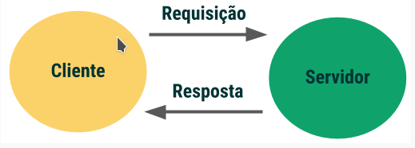
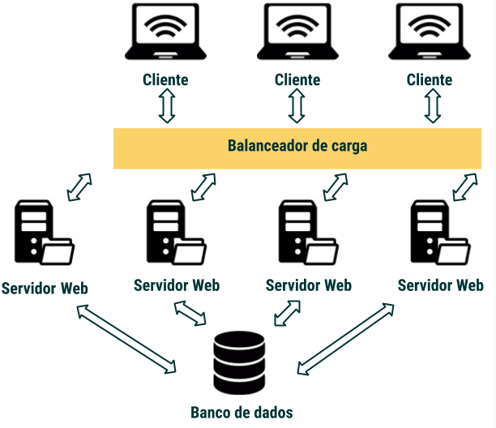

# Importância
Como uma pessoa que irá desenvolver software para a internet, conhecer o seu funcionamento é um requisito primordial.

Atualmente, a grande maioria das aplicações web são desenvolvidas usando o modelo Cliente & Servidor . Você precisa entender esse modelo para entender como o software que você irá desenvolver se encaixa nele. Você precisa, em suma, saber como os servidores funcionam, para quando for colocar um projeto "no ar", ou "em produção".

# Estrutura
- `Cliente`: chrome, firefox, mozilla ... o cliente é uma aplicação que está conetada à internet.  A sua principal função é receber a interação do usuário e traduzí-la em uma requisição  para outro computador chamado `Servidor Web`. Todo computador, tablet e celular tem um número único, como o seu CPF, chamado endereço IP.
- `Servidor`: é um super computador conectado à Internet. Ele também tem o seu próprio endereço IP. O servidor espera por requisições de outras máquinas (clientes). A principal função do Servidor é armazenar, processar e entregar páginas web para os Clientes. Há diversos tipos de servidores, como: _Web Servers, Database Servers, File Servers, Application Servers_. O servidor que usamos para fazer a busca por www.google.com é um _Web Server_.
- `Endereço`: A sigla IP refere-se a Internet Protocol . O endereço IP é um identificador numérico para um dispositivo conectado à rede TCP/IP. Os endereços IP tem quatro campos de dígitos separados por pontos (exemplo: 244.155.65.2).
- `TCP/IP`: _Transmission Control Protocol/Internet Protoco_. Utilizado para transmitir dados na rede, o protocolo de comunicação mais utilizado no mundo.
- `ISP`: ISP ou _Internet Service Provider_ é o seu provedor de Internet. É qualquer empresa que nos fornece acesso Web.
- `DNS`: _Domain Name System_ é um dispositivo com uma base de dados distribuída que gerencia os nomes de serviços, computadores ou qualquer dispositivo conectado à Internet. Ele é usado para relacionar o endereço nominal (google.com) com o endereço IP. Os servidores DNS são responsáveis por localizar e traduzir para números (um endereço IP) as buscas por sites que digitamos no navegador.
- `Port Number`: é um número de 16 bits utilizado para identificar uma porta específica no servidor, e está sempre associado a o endereço IP.
- `Host`: é qualquer pc conectado à rede, seja como cliente, seja como servidor. Cada host tem um endereço IP. Para o site que estamos buscando, www.google.com , o host é o servidor web que hospeda a página na web. É comum confundir o host com o servidor. Servidor é um tipo de host - uma máquina específica com endereço IP. o host pode ser também uma organização inteira que fornece um serviço de hospedagem para manter inúmeros servidores web.
- `HTTP`: _Hyper-text Transfer Protocol_ é o protocolo utilizado para a comunicação entre navegadores e servidores na internet. 
- `URL`: _Uniform Resource Locators_ identifica um recurso web específico. Podemos, como exemplo, mudar a nossa busca para https://www.google.com/travel/flights para pesquisar por preços de passagens aéreas. O URL identifica o protocolo que será utilizado para comunicarmos com o servidor (https), o nome do host (google.com) e o recurso que queremos acessar (travel/flights).


# O modelo client-servidor e a estrutura de uma plicação web


O cliente é responsável por interagir com o usuário. Em uma aplicação Web o cliente é responsável por definir a estrutura , a aparência e mecanismos para lidar com as interações do usuário (como um click, ou um campo para preenchimento).

As interações com o usuário são definidas por uma terceira linguagem: o JavaScript. É o JavaScript que confere à página um comportamento dinâmico. Imagine que você esteja em uma página de e-commerce. Você pode clicar nos items que quer comprar e salvá-los em um carrinho, você pode adicionar filtros nas suas buscas, navegar entre as sessões do site, tudo isso graças ao Javascript! Você deve estar se perguntando: Beleza, eu consigo visualizar tudo o que está acontecendo no momento que faço as compras na loja online. Mas para onde vai o meu pedido no momento em que efetuo o pagamento? O que acontece por trás dos bastidores de um e-commerce?
```javascript
// Limpar o leitor com um click duplo
const clearButton = document.querySelector('.limpar');
clearButton.addEventListener('dblclick', function () {
  inputResultado.value = "";
});
```

O servidor em uma aplicação Web é quem recebe as requisições do cliente. Lembra-se do protocolo HTTP? Pois bem, é aqui que ele entra em cena. É esse protocolo que define uma linguagem para que clientes e servidores se comuniquem. O servidor espera por requisições HTTP de uma porta específica, sempre associada a um endereço IP. Com as requisições, ele vai realizar ações e enviar a resposta via HTTP. Todos os dados que viajam entre o cliente e o servidor são enviados através da rede Internet usando o protocolo TCP/IP.

E por fim, o banco de dados de uma aplicação web é onde a informação é armazenada de forma acessível, gerenciável e em constante atualização. Imagine que você está lançando uma nova rede social, que em cinco anos contará com 500 milhões de usuários ativos no mundo todo. Você certamente irá precisar usar um banco de dados para armazenar informações sobre usuários, posts , comentários. E quando um visitante fizer uma requisição para acessar a página, as informações que serão retornadas para a página virão de um banco de dados. Assim, interações em tempo real, como vemos hoje no Instagram e Facebook, serão viáveis.

Passamos pelos conceitos chaves de uma aplicação Web, e vimos de forma simplificada o seu funcionamento. Mas a medida que a aplicação cresce, como um único servidor conseguirá lidar com milhares - ou até mesmo milhões! - de requisições de usuários em tempo real?

Agora, vamos entender como escalonar uma aplicação web. Uma forma para lidarmos com um grande volume de dados é distribuir o tráfego de informações entre servidores no backend. O responsável por gerenciar o trânsito de informações de uma aplicação entre vários servidores backend é o que chamamos de balanceador de carga.

"Balanceamento de carga" é um termo genérico para uma série de algoritmos que distribuem as requisições para o servidor. Caso você tenha curiosidade em conhecer alguns desses algoritmos, pesquise por dois que são muito populares no design de sistemas distribuídos: Round Robin e Least Connections. Resumidamente, através de algoritmos o balanceador de cargas divide para qual host as requisições serão direcionadas em um sistema de serviços distribuídos.



O balanceador de cargas resolve o problema de tráfego de dados distribuindo as requisições para servidores backend. Mas replicar esse modelo ainda pode gerar problemas a medida que a sua aplicação cresce. À medida que adicionamos mais funcionalidades para a aplicação, sua complexidade é aumentada e a carga de trabalho solicitada ao servidor também cresce, este conjunto de fatores pode sobrecarrega-lo. Assim, para resolver esse problema, é necessário separar o servidor por funcionalidade. É aqui que serviços entra em ação.

Um serviço é apenas outro servidor capaz de interagir com servidores, o que não acontece com um servidor Web, que interage apenas com o cliente. Cada serviço tem uma funcionalidade, como um serviço para autenticação de usuário ou serviços de busca. Assim, é possível quebrar o servidor Web da sua aplicação em múltiplos serviços, cada um com uma funcionalidade específica. A grande vantagem dos serviços é que você pode escaloná-los de forma independente. Além disso, os times de uma empresa também podem trabalhar de forma independente em um determinado serviço, ao invés de ter uma equipe numerosa trabalhando em um único servidor, o que poderia se tornar um grande problema de gestão de projeto.

udo o que vimos até agora funciona muito bem para escalonar o tráfego de dados. Mas a sua aplicação ainda está centralizada em um único lugar. Quando usuários do mundo todo começarem a acessar o seu site, eles podem ter um tempo de resposta maior devido à grande distância entre cliente e servidor. Uma forma de resolvermos esse problema é usando o que chamamos de Rede de Distribuição de Conteúdo, ou Content Delivery Network (CDN) . O CDN é um sistema de distribuição de servidores "proxy". Podemos entender um servidor proxy como sendo um intermediário entre cliente e servidor.

Empresas com uma grande quantidade de tráfego distribuído no mundo todo podem pagar por companhias que oferecem serviços de CDN. Assim, usuários de diversas localidades poderão acessar a aplicação com um tempo de resposta menor. Um exemplo é a Akamai , que tem sedes em pontos estratégicos no mundo todo para garantir uma melhor experiência ao usuário. Se o conteúdo da sua aplicação Web não precisa cruzar o oceano para que um usuário na China possa utilizá-lo, o tempo de resposta é muito menor. A Akamai, por exemplo, consegue reduzir esse tempo de latência ao armazenar cópias do conteúdo da aplicação (arquivos como o HTML, CSS, mídia) do servidor dos seus clientes. Assim, a Akamai consegue fornecer a aplicação para o usuário de seus clientes sem precisar ter acesso ao seu servidor de quem a contratou.


# Protocolo HTTP
É através desses protocolos que conseguimos acessar páginas, fazer downloads, enviar emails. Dentre os protocolos, há dois que são frequentemente utilizados: o protocolo TCP/IP e o protocolo HTTP. O TCP/IP é a base de envio e recebimento de dados de toda a Internet.

No modelo Cliente-Servidor, a troca de mensagens acontece através de requisições e respostas: o Cliente envia uma requisição ao Servidor, que irá lhe retornar uma resposta. Cada requisição e resposta trocada entre Cliente e Servidor é uma única transação HTTP. O HTTP é uma linguagem de texto, o que significa que as mensagens trocadas são quantificadas em bits. Cada mensagem é dividida em duas partes: o header e o body.

Por outro lado, HTTPS é uma forma mais segura de comunicação que utiliza a encriptação. Para adicionar mais essa camada de segurança, o HTTPS utiliza um segundo mecanismo de segurança: o SSL.Websites grandes com milhares de usuários, como o Google e o Facebook, utilizam o protocolo HTTPS para manter as nossas senhas, informações pessoais e até mesmo detalhes de cartão de crédito em segurança na rede.

Na barra de navegação com a janela de inspecionar aberta: https://github.com/betrybe/. Selecione o primeiro nome e a aba Headers.

## HTTP Headers
O HTTP é composto por header e body. o header contém _metadata_  (dados sobre dados) que incluem o tipo de requisição (GET, POST, PUT, DELETE), o camimho URL, o endereçpo IP dentre outros. Para a página que estamos usando como exemplo, na sessão _Response Headers_ os mais importantes são:
- `Content-Type`: text/plain Especifica como os dados são representados. Nesse exemplo, temos o texto sendo enviado como resposta no formato HTML.

- `Server`: GitHub.com Servidor Web para onde as requisições estão sendo feitas.

- `Status`: 200 OK Forma padrão para o servidor comunicar ao cliente sobre o resultado da requisição. O código 200 significa que o servidor encontrou o recurso e está enviando o resultado da requisição.
- `Host`: api.github.com Host da aplicação

- `cookie`: _octo=GH1.1.358825508.1593780201; _ga=GA1.2.60245099.1593780202; logged_in=yes; dotcom_user=isabellavjs; tz=America%2FSao_Paulo

## HTTP Body
O servidor armazena então os dados (metadados) mais importantes para estabelecer uma comunicação com o cliente. O Body refere-se ao corpo da mensagem que está sendo transmitida. Você pode acessá-lo clicando em Response na barra superior, o body contém o HTML para a página.

## Métodos HTTP
São os verbos que dizem ao servidor o que fazer com os dados no URL.
- `GET`: As requisições GET são apenas para leitura , o que significa que os dados nunca poderão ser modificados no servidor. O método GET apenas retorna dados. Requisições GET são respondidas com status 200 (OK) se o recurso que estamos querendo acessar for encontrado com sucesso, ou 404 (NOT FOUND) se a página não for encontrada.

- `POST`: Você usará o método POST para criar um recurso subordinado (ex: novo usuário).

- `PUT`: O método PUT é utilizado para atualizar o recurso identificado pelo URL. Esse método também pode ser utilizado para criar um novo recurso. Requisições PUT não são consideradas operações seguras, pois o estado da aplicação é modificado no servidor.

- `DELETE`: o método DELETE é utilizado para deletar um recurso identificado pelo URL.


# REST
É um tipo de arquiterura utilizada no design de aplicações web. O estado  da aplicação são os dados necessários para que o servidor possa atender a uma determinada requisição. O `REST` guia a desenvolver um sistema mais performático, escalável, simples, manutenível, mutável, portátil e confiável. Dentre isso, podemos destacar:
- `Interface uniforme`:  define a interface entre cliente e servidor de forma a desacoplar a arquitetura da aplicação. Dentre as definições previstas pelo REST, as mais importantes são:
- - Recursos, como dados de um banco de dados, devem ser identificados na requisição e o cliente terá acesso apenas a representação do recurso (ex: JSON, HTML)
- - O cliente deve ter informações suficientes para manipular recursos no servidor utilizando representações
- - As mensagens trocadas entre cliente e servidor devem ser auto-descritivas

- `Stateless`: Essa regra define que todos os dados do estado da aplicação que precisam ser manipulados em uma requisição devem estar contidos na própria requisição (URL, HTTP body, HTTP header) e o servidor deve encaminhar para o cliente todos os dados referentes ao estado na resposta (HTTP headers, status code, HTTP response body).


# Curl
Abreviação para Client URL . Ele é um comando disponível na maioria dos sistemas baseados em Unix que serve para verificar conectividade, além transferir dados via terminal.

1. Sintaxe básica do `curl`
```
curl [options] [url]
```
- `options` aqui podemos especificar diversas opções que permitem acessar informações e definir comportamentos, como:
- - `-u` ou `--user`: Permite especificar nome de usuário e senha para autenticação no servidor.
- - `-T` ou `--upload-file`: permite transferir arquivos locais para uma URL remota.
- - `-s` ou `--silent`: coloca o `curl` em modo silencioso. Este comando fará com que mensagens de erro e status de progressão não gerem nehum tipo de notificação.
- - Caso queira mais opções, é possível acessar o manual completo co `curl` através do comando `curl --manual`.
- `URL` é o endereço WEB ao qual vamos nos referir para fazer nossas requisições via comando `curl`.

2. Agora faremos nossa primeire requisição para um site.
```
curl testdomain.com
```
- Note que a resposta que você receberá no terminal será um código `HTML` que como vimos anteriormente, permite configurar a estrutura física da página web.
- Além disso, as tags `<html> , <head> , <title> , <body> e <h1>` estão presentes na resposta.

3. Nesta etapa, utilizaremos uma **option** do comando curl , conhecida como `--head`. Ela nos permitirá ter acesso a todo cabeçalho da página. Não se preocupe em entender todos os detalhes, vários pontos que estão presentes nesta resposta serão vistos por você com profundidade ao longo do curso!
```
curl --head https://www.betrybe.com/
```
- Nesta requisição ao site da trybe, recebemos algumas informações como por exemplo:
- - **Status da requisição** : está representado pelo número 200, e nos informa que nossa requisição foi feita com sucesso.
- **Server** : Servidor Web para onde as requisições estão sendo feitas.
- **Content-type** : Especifica como os dados são representados. Neste caso, `text/html`.

4. Por fim, fazer uma requisição de download para uma URL específica, utilizando a option `-O`. A partir desta requisição você terá acesso ao arquivo localmente, no diretório em que o terminal está rodando.
```
curl -O https://uploads-ssl.webflow.com/5dbd9ce75ad64f24b67f0932/5dbdd9165ad64f5e29811c52_BRAND3.png
```
- Note que o arquivo em sua máquina terá o mesmo nome do arquivo remoto. É comum que as nomenclaturas de arquivos remotos não sejam descritivas. Para resolver este problema, podemos utilizar uma segunda option do comando `curl` que nos permitirá nomear o arquivo da forma que desejarmos.
```
curl -o trybe_logo.png https://uploads-ssl.webflow.com/5dbd9ce75ad64f24b67f0932/5dbdd9165ad64f5e29811c52_BRAND3.png
```
- agora o download foi feito com o nome `trybe_logo.png`.

Por ora, `curl` ficará até aqui. 


## Curl - recursos adicionais
- [O Que é Comando Curl e Como Usar?](https://www.hostinger.com.br/tutoriais/comando-curl-linux)
- [21 exercícios sobre cURL 👈](https://jvns.ca/blog/2019/08/27/curl-exercises/)
- [Tutorial sobre como inspecionar a atividade de uma página na rede](https://developers.google.com/web/tools/chrome-devtools/network/?hl=pt-br)
- [Como a internet funciona - playlist em português](https://www.youtube.com/watch?v=HNQD0qJ0TC4&list=PLQq8-9yVHyOYMFAc9v7Yb_cqmNMksEdrk)
- [Como funciona o DNS - vídeo 6 min](https://www.youtube.com/watch?v=72snZctFFtA&feature=youtu.be&t=45s)
- [O que é um navegador - vídeo 1 min](https://www.youtube.com/watch?v=BrXPcaRlBqo&feature=youtu.be)
- [Um conto de pacotes. Como funciona a internet? - vídeo 3 min](https://www.youtube.com/watch?v=ewrBalT_eBM)


## Resumo do fluxo de dados
O `cliente` entra com o `dns` (nome do site), que vai solicitar ao servidor `DNS` e vai retornar o `IP` do site buscado pelo cliente, validando-o. Qunado o `cliente` faz uma `requisição` via `ptocoto HTTP` (download, por exemplo), essa requisição é enviada a um `SEVIDOR` que vai retornar uma `resposta` em forma de `status` ao cliente, estando tudo certo a resposta é `renderizada`.
