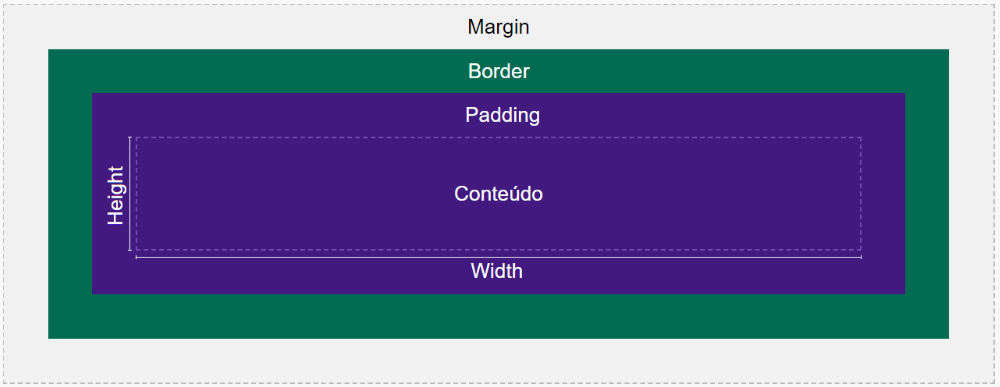
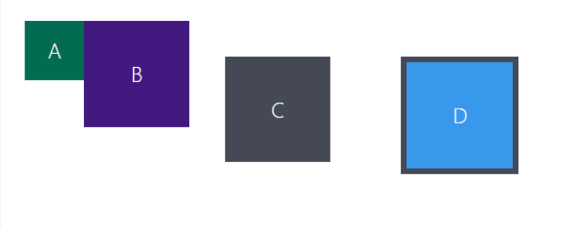

# Box Model
A primeira coisa que temos que deixar bem explícita é que todos os elementos HTML são renderizados como caixas pelo browser. Por isso nós usamos o termo "box model" ou "modelo de caixas" quando nos referimos a essa forma de renderização e, por tabela, quando falamos de alguns elementos do layout.

### *width e height*
Especificam, respectivamente, a largura e a altura da área de conteúdo, desconsiderando as bordas, margens e padding.

### _padding_
Pode ser traduzido como "enchimento" e controla a quantidade de espaço vazio entre o conteúdo em si e a borda da caixa.

### _border_
É a borda da caixa, pura e simples. 
- `border-width`: também pode controlar a largura da borda e o seu valor inicial é `medium` .
- `border-style`: essa propriedade controla o estilo da linha e tem como valor inicial `none` . Por isso que você não consegue ver nenhuma borda se não alterar essa propriedade !
- `border-color`: essa propriedade controla a cor da borda, e tem como valor inicial `currentcolor` . Esse valor define a cor da borda como sendo o mesmo do elemento, então na maioria dos casos é desejável modificá-la.

### *margin*
Ela fica do lado de fora da borda e não é afetada pela estilização do elemento, servindo mais para manejar o afastamento entre as caixas.

## Referências
[MDN](https://developer.mozilla.org/pt-BR/docs/Learn/CSS/Building_blocks/The_box_model)
[W3Scholls](https://www.w3schools.com/css/css_boxmodel.asp)