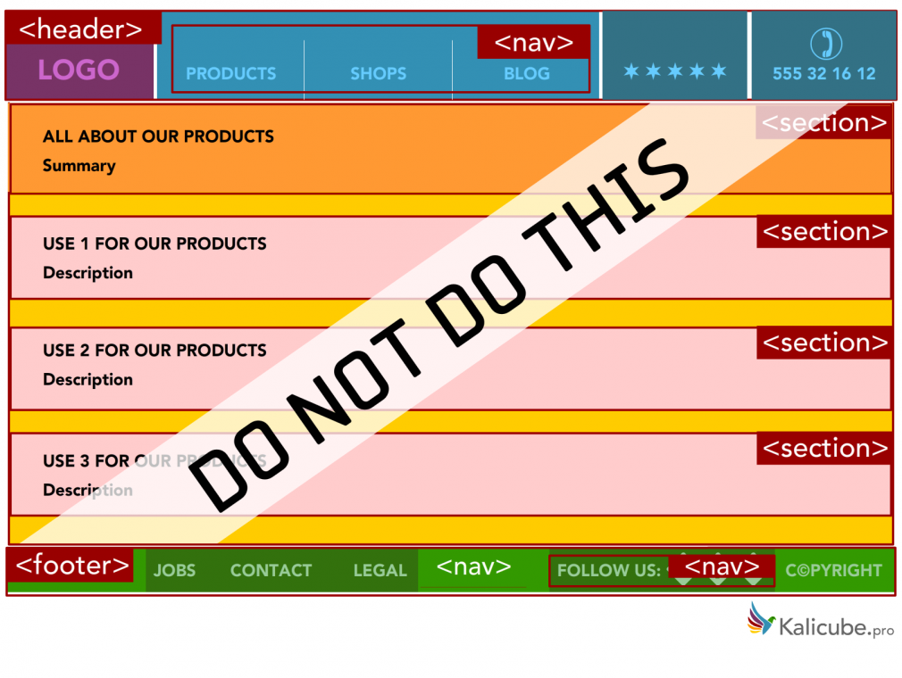
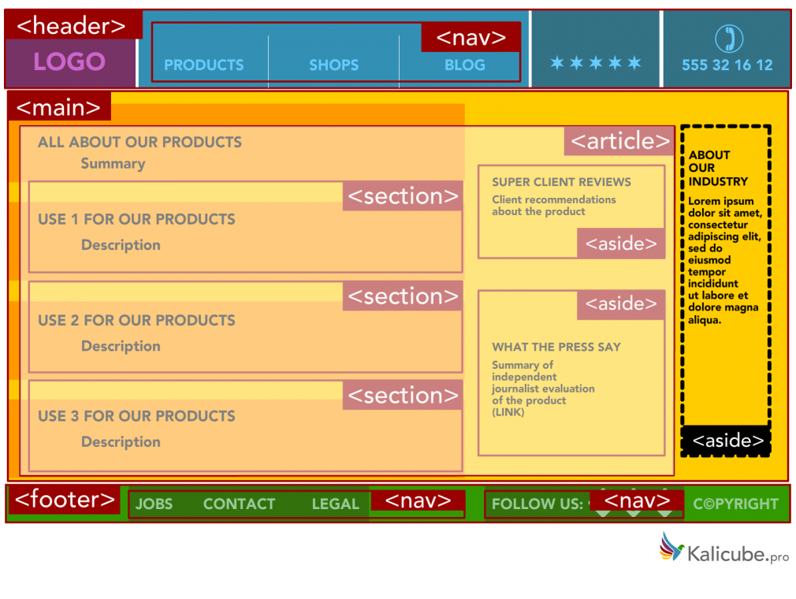

# HTML de acordo com o sentido
Suponha que, no seu dia a dia de desenvolvimento de software, na empresa em que trabalha, você precise implementar uma funcionalidade de mostrar a foto de perfil do usuário na tela inicial do site da empresa, de forma a prover uma experiência mais pessoal.

Qual elemento HTML você usaria para conter a imagem do usuário?

Você faz uso de img , finaliza o que precisava fazer para implementar a funcionalidade de mostrar a foto do perfil, abre um Pull Request (PR) e seus colegas de trabalho fazem o Code Review (CR).

Alguém no Code Review chega no seu código e comenta:
> Mas eu poderia fazer a mesma coisa usando div nessa linha! Por que você usou img ?

Qual resposta você daria? Uma possível seria algo do tipo:

> Você tem razão, eu poderia, mas será que faria sentido? Eu usar o elemento img para guardar uma imagem agrega muito mais valor para o documento do que se eu usasse uma div , haja vista que uma div é um elemento genérico, que serve para agrupar qualquer coisa. Ao usar o elemento img , eu estou comunicando que o conteúdo é uma imagem. 

## Tags
- `<header>` - cabeçalho
- `<nav>` - conjunto de links de navegação
- `<main>` - agrupa o conteúdo principal da página: artigo, seção e barra lateral 
- `<article>` - usada para conteúdos auto-ontidos. Todo o conteúdo presente dentro de um article provê as informações necessárias para sua compreensão, podendo ser reusado em outras páginas.
- `<section>` - representa uma seção do documento, agrupando conteúdos relacionados. 
- `<aside>` - representa um conteúdo à parte. Alguns exemplos de sua utilização são: barras laterais e/ou conteúdos adjacentes à um conteúdo principal.
- `<footer>` - representa o rodapé do documento e/ou de uma seção.

### Referências
Imagens retiradas do site [semrush](https://www.semrush.com/blog/semantic-html5-guide/)