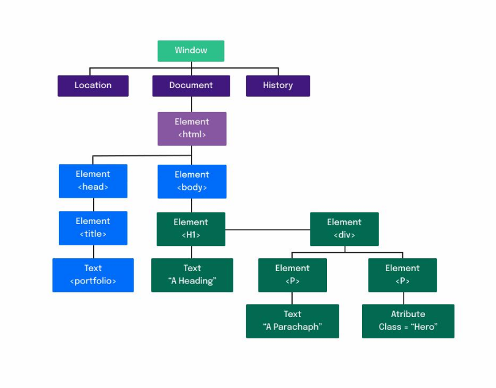

# Parte I - O DOM. Ou: como o HTML e o JavaScript se comunicam?
O `DOM` (Document Objeto Model) é uma interface que representa como os `HTML`e `XML` são lidos pelo browser. Após a leitura do documento `HTML` pelo browser, o `DOM` cria um objeto que faz uma representação do documento e define meios de como essa estrutura pode ser acessada, dessa forma podemos utilizar o JavaScript para manipular o `DOM` e assim alterar o estilo e o conteúdo de nossa página.

No `DOM` nossa página é representada por nós e objetos, e é através deles que iremos realizar a comunicação do nosso `HTML` com o `JavaScript` . Sendo assim, podemos dizer que o `DOM` é uma representação orientada a objetos da página da web, que pode ser modificada com uma linguagem de script como JavaScript.

### Estrutura DOM

- `Window` : Representa uma janela __que contém um elemento DOM__, sendo possível acessar o documento que a janela contém através de Window ;
- `location` : Representa a __localização do objeto__ a qual ele está associado, isso é, o documento atual;
- `document` : Representa qualquer página da web carregada no navegador e serve como um ponto de entrada para o conteúdo na página da web, sendo assim o document __contém todos os documentos HTML__ ;
- `history` : Permite a manipulação do __histórico da sessão__ do navegador, ou seja, as _páginas visitadas_ na guia ou quadro em que a página atual está carregada;
- `element` : É a classe base mais geral da qual todos os objetos em um Document herdam, isso é, são todas as __tags__ que estão em arquivos HTML e se transformam em elementos da árvore DOM ;
- `text` : Texto que vai entre os elementos, é todo o __conteúdo__ das tags;
- `atribute` : São todos os atributos que um nó específico possui, como uma __class ou id__ .

> A página HTML/CSS/JS é um programa. O navegador é quem interpreta esse código e, a partir dele, gera a página que vemos na internet.
> O DOM é uma estrutura da página montada pelo navegador. O seu intuito é justamente permitir ao programa acessar os elementos da página usando código e dar a ele o poder de manipulá-las.

## REFERÊNCIA
[DOM](https://www.w3schools.com/jsref/dom_obj_all.asp)