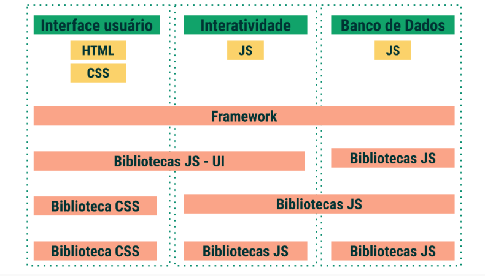

# Como adicionar bibliotecas JavaScript e CSS aos seus sites.
- Utilizar bibliotecas JavaScript externas a partir de uma [CDN](https://www.gocache.com.br/cdn/).

## Frameworks CSS que facilitam a construção de sites dinâmicos, acessíveis e responsivos,
- [Bulma](https://bulma.io/)
- [Bootstrap](https://getbootstrap.com/)
- [Semantic Ui](https://semantic-ui.com/)
- [Materialize](https://materializecss.com/)

## Frameworks JS
- [Moment](9https://momentjs.com/)
- - moment.js, tem funções para validação, manipulação e visualização de data e hora;
- [JQuery](https://jquery.com/)
- [Hightcharts](https://www.highcharts.com/)
- - biblioteca usada para criar gráficos interativos
- 

Quando uma pessoa programadora cria uma biblioteca, a sua intenção é compartilhá-la com toda a comunidade e, para isso, ela irá se esforçar para escrever uma documentação com bons exemplos para podermos reutilizar funções que são corriqueiras - como manipular datas, exibir alertas, validar campos, dentre outras.

Algumas bibliotecas têm o seu próprio servidor. Outras, são distribuídas a partir de uma CDN externa. Uma CDN ( Content Delivery Network ) é uma rede de servidores para a distribuição de conteúdos. Ela armazena réplicas de conteúdos de outros sites e os entrega para o usuário.

- [CDNJS - hospedeiro de bibliotecas](https://cdnjs.com/libraries)

Para escolher qual biblioteca usar, é preciso pensar na sua aplicação a partir da sua composição. Uma página Web é composta por uma interface com o usuário (HTML e CSS), por elementos de interatividade (Javascript e DOM) e por um banco de dados (que também pode ser acessado por Javascript). Algumas bibliotecas são específicas para a interface com o usuário, enquanto que outras podem ser utilizadas em diferentes partes da aplicação.

Bibliotecas que "fazem de tudo" são chamadas de frameworks. Elas atuam desde a recuperação de dados até a manipulação do DOM e interface com o usuário. 
Por outro lado, por fazer coisas demais, em algumas situações usar bibliotecas menores pode ser mais vantajoso, pois elas são focadas em tarefas específicas