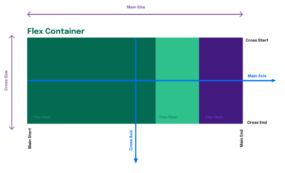

## Flexbox é uma ferramenta que nos permitirá criar páginas com design responsivo de forma simples e organizada.

1. Primeiro passo é é criar um flex container com o display: flex
- - Elementos filhos de um Flex container são chamados `Flex itens` e são dispostos denstro dele com com as propriedades flexbox.
```css
.flex-container{
    display: flex;
}
```

## Antes de entrar no flexbox
## Flex Axis x Flex Lines
- Flex Axis
- - O layout do Flexbox é baseado em __flex-directions__ com as direções determinadas por eixos (axis).

  
- O __main axis__ tem a direção definida pela propriedade `flex-direction`, que pode ser _horizontal_, quando **flex-direction:** row ou **flex-direction: row-reverse**, e _vertical_, quando *flex-direction: column* ou *flex-direction: column-reverse*.
  
- Flex lines
- - S#ao linhas usadas para o agrupamento e alinhamento de flex itens dentro de seus containers. um Flex pode ser *single-line* ou *multi-line*, dependendo da propriedade `flex-wrap`.
- - Um Flex container single-line dispõe todos os seus filhos (flex items) em uma única linha;
- - Um Flex container multi-line quebra seus flex items em múltiplas linhas. Isso é similar ao que acontece quando um texto é quebrado em uma nova linha quando está muito grande ( overflow ).


# Estrutura
- `flex-direction` define a direção dos flex items e modifica o Main Axis
- - *row* os elementos ficam em linha
- - *row-reverse* os elementos ficam em linha reversa
- - *column* os elementos ficam em coluna única
- - *column-reverse* os elementos ficam em coluna única reversa
- `flex-wrap` define ou não quebra de linha
- - *nowrap* não quebra linha
- - *wrap* faz quebra de linha
- - *wrap-reverse* faz quebra de linha em direção contrária
- `flex-flow` é um atalho para as propriedades __flex-direction__ e __flex-wrap__
- - o primeiro valor que recebe é do __flex-direction__ e o segundo é do __flex-wrap__.

# Posicionamento 
- `justify-content` alinha o espaçamento entre os flex-items
- - *center* alinha ao centro do main axis
- - *flex-end* alinha ao fim do main axis
- - *space-around* alinha colocando espaço entre os items e a margem
- - *space-between* alinha colocando espaço entre os itens
- - *space-evenly* alinha colocando o mesmo escaço entre os itens e a margem 
- `align-items` alinha os flex-items como um todo
- - *strech* estica os itens
- - *flex-start* alinha no topo do flex
- - *flex-center* alinha no centro do flex
- - *flex-end* alinha no chão do flex
- - *base-line* alinha os items pela linha base deles
- `align-content` trabalha junto ao **align-items**, ajustando o espaçamento entre as alinhas
- - *space-around* espaçamento ao redor do itens
- - *space-betwen* espaçamento entre os itens